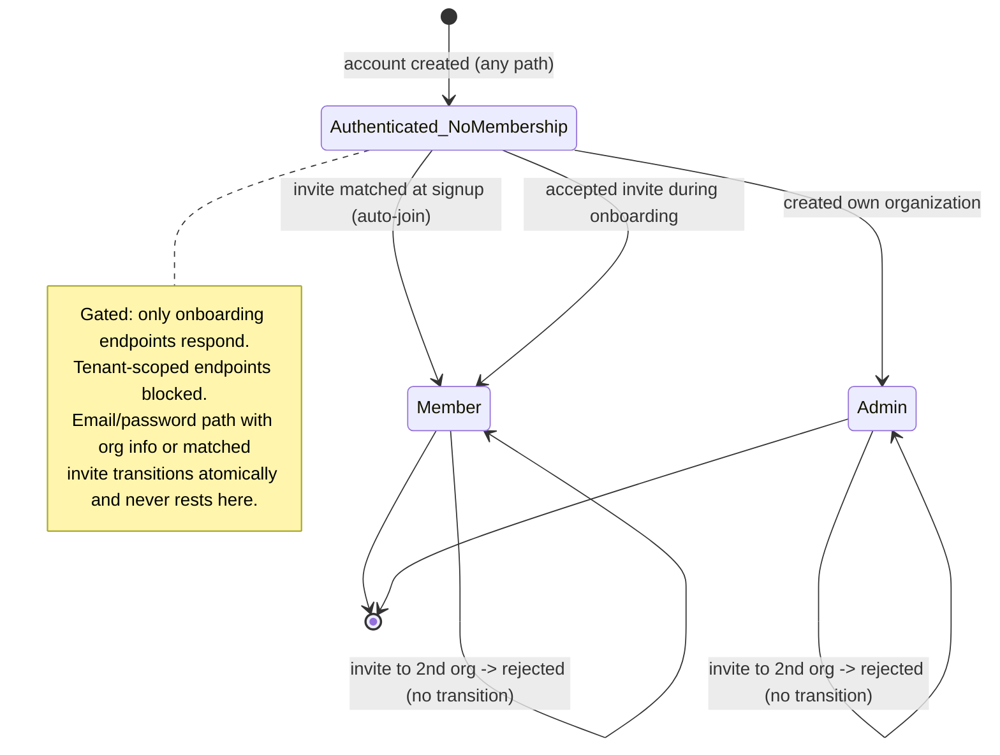

# Auth–Tenant Provisioning — Spec

## 1. Business Context

The authentication system and the multi-tenant (organization) system both work in isolation, but nothing connects them at the moment a user is created. Today a user can sign up — by email/password or by social login — and end up **orphaned**: the account exists, but it has no organization membership and therefore no tenant. Every tenant-scoped feature in the product reads `user.organization_membership`; for an orphaned user that relationship is absent, so those features either error or return nothing.

The product's data model is multi-tenant by construction. A user without an organization is not a partial user — they are a user who cannot use the product at all. The only ways a user can currently reach a tenant are to manually create an organization through a separate endpoint after signup, or to be invited and then separately accept that invite. Neither path is wired into the signup flow, so the default outcome of "create an account" is a dead end.

Stakeholders affected: anyone owning activation/onboarding (a new account that can't do anything is a hard stop), the support surface (orphaned users have no self-evident next step), and the engineering teams building tenant-scoped features (who currently must assume every authenticated user has a membership, which is not guaranteed).

Cost of doing nothing: every self-service signup that is not preceded by an invite lands in a non-functional state. This is not a degradation — it is a broken core path. There is no metric to "improve"; the requirement is to make account creation always result in a usable, tenant-bound user.

The building blocks already exist and are not in question: organization creation (creator becomes the first admin), invitations (secure 7-day token, email-addressed, can target an address that has no account yet), and invite acceptance (creates the membership). What is missing is the wiring that guarantees every newly authenticated user passes through exactly one of two doors — *create your own organization* or *join the organization that invited you* — before they can touch tenant data.

## 2. Hypothesis (to be validated)

Not a hypothesis — known requirement. Driver: an authenticated user with no organization membership is a broken state that makes the product unusable for that user. This must be fixed for the multi-tenant product to function. Correctness and definition-of-done matter; there is no metric to validate or roll back against.

## 3. Objectives (and definition of done)

1. **No orphaned users after signup.**
   - Signal: for every account-creation path (email/password, social), the user either holds an organization membership immediately on completion, or is held in a gated onboarding state that *cannot* be exited except by gaining a membership.
   - Source: integration tests covering each signup path; absence of any code path that yields an authenticated, non-gated user with no membership.
   - Threshold: zero paths produce an ungated membership-less user.
   - Definition of done: every acceptance scenario in **Decisions → Acceptance scenarios** passes.

2. **Invited users land in the inviting organization, never a stray one.**
   - Signal: when a signup email matches a pending invitation, the resulting membership is in the inviting organization and no new organization is created for that user.
   - Source: integration tests for the invite-then-signup paths (email and social).
   - Threshold: zero stray organizations created for invited signups.

3. **The one-organization-per-user invariant is never violated.**
   - Signal: no path creates a second membership for a user who already has one; such attempts fail with a clear, surfaced error rather than a database integrity error or silent org switch.
   - Source: integration tests for already-member-accepts-invite and already-member-receives-second-invite.
   - Threshold: zero unhandled integrity errors; every conflict produces a meaningful error response.

4. **Tenant-scoped surfaces are unreachable until a membership exists.**
   - Signal: an authenticated user with no membership is blocked from all tenant-scoped endpoints; only the onboarding endpoints (create organization, accept/auto-join invite) respond.
   - Source: integration tests asserting tenant endpoints reject the membership-less user.
   - Threshold: no tenant-scoped endpoint serves data to a membership-less user.

## 4. Decisions

### 4.1 Use-cases

**Use-case 1 — Self-service email/password signup, no invite.**
- Actor: a new user signing up with email and password, who was not invited.
- Trigger: submits the signup form.
- Flow:
  1. User provides personal details (as today) **and** the information needed to create an organization.
  2. The system creates the user account and profile.
  3. In the same atomic operation, the system creates a new organization and makes the user its first admin.
  4. The user is returned authenticated and already bound to their own tenant.
- Outcome: user exists, owns a new organization, holds an admin membership. No onboarding gate.

**Use-case 2 — Email/password signup by an invited address.**
- Actor: a person whose email was invited to an existing organization, signing up for the first time.
- Trigger: submits the signup form with an email that matches a pending invitation.
- Flow:
  1. The system detects the pending invitation matching the signup email.
  2. Organization-creation fields are not required and are ignored if present.
  3. The system creates the user account and profile.
  4. In the same atomic operation, the system creates the membership joining the user to the inviting organization (member role) and marks the invitation accepted.
- Outcome: user exists and is a member of the inviting organization. No new organization created. No separate accept step required.

**Use-case 3 — Social signup, no invite.**
- Actor: a new user authenticating via a social provider, not invited.
- Trigger: completes the social provider handshake; the account is auto-created.
- Flow:
  1. The system creates the user account and profile from the provider's data (as today). No organization information is available from the provider.
  2. The user is authenticated but holds no membership; they are placed in a gated onboarding state.
  3. The user is prompted to create an organization, providing the organization information.
  4. The system creates the organization and makes the user its first admin; the gate lifts.
- Outcome: user exists, owns a new organization, holds an admin membership.

**Use-case 4 — Social signup by an invited address.**
- Actor: a person whose email was invited, authenticating via a social provider for the first time.
- Trigger: completes the social provider handshake; the email matches a pending invitation.
- Flow:
  1. The system creates the user account and profile from the provider's data.
  2. The system detects the pending invitation matching the user's email.
  3. The system creates the membership joining the user to the inviting organization and marks the invitation accepted.
  4. The onboarding gate never engages; no create-organization prompt is shown.
- Outcome: user exists and is a member of the inviting organization. No new organization created.

**Use-case 5 — Invited address that already has an account and a membership.**
- Actor: a user who already belongs to an organization, who is invited (or attempts to accept an invite) to a second organization.
- Trigger: an invite acceptance / auto-join is attempted for a user that already holds a membership.
- Flow:
  1. The system detects the user already has a membership.
  2. The join is refused with a clear, surfaced error ("you already belong to an organization").
  3. The user's existing membership and organization are left untouched; the invitation remains pending (revocable by an admin).
- Outcome: no second membership; no silent org switch; existing tenant data and admin role preserved.

### 4.2 State transitions & edge cases

**User-to-tenant lifecycle (post-authentication):**

- **Gating rule:** the `Authenticated_NoMembership` state is a hard gate. While in it, only the onboarding endpoints (create organization, accept/auto-join invite) respond; every tenant-scoped endpoint refuses. The email/password happy paths transition out of it atomically and never actually rest in it; social signup is the path that genuinely sits in this state until the user acts.
- **One organization per user:** a user holds at most one membership. Once `Member` or `Admin`, no path creates a second membership. Attempts are rejected (see Use-case 5), never resolved by switching organizations.

**Edge cases and decided handling:**
- **Invited address signs up via email with org-creation fields filled in anyway:** invitation takes precedence; org fields ignored, user auto-joins the inviting org. No stray organization.
- **Already-member user accepts an invite (any channel):** rejected with a clear error; existing membership untouched; invitation left pending.
- **Already-member user is sent a new invite:** invitation may exist as a pending record, but it can never be redeemed while the user has a membership; redemption attempts are rejected as above.
- **Social user abandons onboarding:** remains gated indefinitely; no tenant access; re-authenticating returns them to the same gate until they create an org or an invite is matched.
- **Expired invitation at signup time:** treated as no pending invitation — the user follows the no-invite path for their channel (email: create own org; social: gated onboarding to create own org).
- **Multiple pending invitations for the same email (different orgs):** at most one auto-join occurs. Which invitation wins is an **Open question**.

**Idempotency:** account creation is not a retry-safe upsert and must not produce duplicate users, duplicate organizations, or duplicate memberships on a replayed or double-submitted signup. The membership-creation step must be guarded so a second attempt for an already-member user is a rejected no-op rather than an integrity error. Auto-join on a signup whose invitation was already consumed is a no-op that leaves the existing membership in place.

**Concurrency:** two near-simultaneous attempts to give the same user a membership (e.g., a double-submitted social onboarding, or an invite auto-join racing a manual create-org) must resolve to exactly one membership; the loser is rejected with the already-member error, not a database error. The one-membership-per-user constraint is the backstop and must surface as a meaningful error, not a 500.

**Time-bounded behavior:** invitations already carry a 7-day expiry; expired invitations are inert (see edge cases). No new time-bounded rules are introduced. The gated onboarding state has no expiry — it persists until resolved.

### 4.3 Acceptance scenarios

1. **Happy path — self-service email signup (no invite).**
   Given an email that matches no pending invitation,
   When the user submits the signup form with valid personal and organization information,
   Then a user, an organization, and an admin membership for that user are created atomically, and the user is not gated.

2. **Happy path — social signup then create org (no invite).**
   Given a new social signup whose email matches no pending invitation,
   When the user authenticates and then completes the create-organization onboarding step,
   Then an organization and an admin membership are created and the onboarding gate lifts.

3. **Integration-driven — invited email signs up (never had an account).**
   Given a pending invitation addressed to an email with no existing account,
   When that email completes signup (email/password or social),
   Then the user joins the inviting organization with a member membership, no new organization is created, and the invitation is marked accepted — with no separate accept step.

4. **Edge — invited social user skips the org prompt.**
   Given a pending invitation matching a social signup's email,
   When the user authenticates,
   Then the membership to the inviting organization is created automatically and the create-organization prompt is never shown.

5. **Negative — already-member user attempts to join a second org.**
   Given a user who already holds a membership,
   When an invite acceptance or auto-join to a different organization is attempted,
   Then the attempt is refused with a clear "already belongs to an organization" error, the user's existing membership is unchanged, and no second membership is created.

6. **Negative — gated user hits a tenant-scoped endpoint.**
   Given an authenticated user with no membership (mid-onboarding social user),
   When they call any tenant-scoped endpoint,
   Then the request is refused and only the onboarding endpoints remain available to them.

7. **Edge — expired invitation at signup.**
   Given an email whose only matching invitation has expired,
   When that email signs up,
   Then no auto-join occurs and the user follows the no-invite path for their channel (own org on email signup; gated create-org onboarding on social).

### 4.4 Negative scope

- **Multiple organizations per user.** Out. The one-organization-per-user (OneToOne membership) invariant is preserved deliberately; no schema refactor to support a user belonging to several organizations.
- **Switching or leaving organizations.** Out. No flow to move a user between organizations or to leave one. Already-member conflicts are rejected, not resolved by switching.
- **Promote/demote members.** Out. Admin is conferred only by being an organization's creator, exactly as today. No member-role management is added by this work.
- **Changing the invitation mechanism.** Out. Token format, 7-day expiry, email addressing, and the existing send/revoke behavior are unchanged. This work consumes invitations at signup; it does not redesign them.
- **Self-service organization deletion or teardown.** Out.
- **The existing explicit accept-invitation endpoint's contract for already-authenticated users.** Hands-off — its behavior for a logged-in user accepting a token must continue to work; this work adds auto-join at signup alongside it, it does not replace it.
- **Provider/scope changes to social login.** Out. The social handshake itself (providers, scopes, profile-picture fetch) is unchanged; this work begins after the account is created.
- **Onboarding UI/UX design.** Out at spec level. That the social path is gated and prompts for organization information is decided; the screens, copy, and styling are downstream.

## 5. Alternatives considered

- **Auto-create an organization for every new user silently (including invited and social), then reconcile.** Rejected: it manufactures stray organizations for invited users, which then collide with the one-org-per-user invariant and require cleanup. Detecting the invite first avoids creating an organization that must immediately be discarded.
- **Leave signup unchanged and require every user to create an organization via the existing separate endpoint.** Rejected: this is effectively today's behavior and is the broken state this spec exists to fix — it leaves a window of orphaned, non-functional users.
- **Allow membership-less users limited (soft) access to the app.** Rejected in favor of a hard gate: a soft state multiplies the number of code paths that must defend against a missing membership, which is the exact fragility this work removes. The hard gate makes "authenticated implies either gated-onboarding or has-membership" an enforceable invariant.

## 6. Open questions

1. **Multiple pending invitations for the same email, to different organizations.** Recommended default: auto-join the most recently created non-expired invitation and leave the rest pending. Owner: product. Unblocks: the auto-join selection rule and its test in scenario 3/4.
2. **What organization information the signup form collects beyond name.** The organization can be created with just a name today (room-sync is an optional flag, default off). Recommended default: collect name only at signup; do not enable room-sync during signup. Owner: product. Unblocks: the email signup form contract and the social create-org onboarding contract.
3. **Whether a gated social user should be allowed account-level (non-tenant) self-service** such as editing their own profile or signing out. Recommended default: allow account-level self-management and sign-out; block only tenant-scoped surfaces. Owner: product/eng. Unblocks: the precise boundary of the hard gate in scenario 6.
4. **Surfacing the already-member rejection to the inviting admin.** Recommended default: the join simply fails for the invitee with a clear error; no proactive notification to the admin, the stale invitation is left for manual revoke. Owner: product. Unblocks: Use-case 5 outcome wording.

## 7. Risks assumed

- **Risk:** a race or double-submit creates two memberships and trips the one-per-user constraint as a raw database error instead of a clean rejection. **Assumption that makes it real:** the membership-creation step is not uniformly guarded across all entry paths (signup auto-join, create-org, explicit accept). **Mitigation:** centralize membership creation behind a single guarded operation that checks for an existing membership and converts the constraint violation into the surfaced already-member error. **Likelihood/severity:** medium / medium.
- **Risk:** invited-email detection misfires — a self-service signup is wrongly matched to a stale or unrelated invitation, joining the user to the wrong organization. **Assumption that makes it real:** invitation matching is by email alone and an expired/duplicate record is not filtered. **Mitigation:** match only non-expired, unaccepted invitations; resolve the multiple-invitation case explicitly (Open question 1). **Likelihood/severity:** low / high.
- **Risk:** an existing assumption elsewhere in the codebase that "an authenticated user always has a membership" is currently false and may already be masked; tightening the gate could expose latent call sites. **Assumption that makes it real:** some tenant-scoped code reads `user.organization_membership` without guarding for absence. **Mitigation:** the hard gate makes the invariant true going forward; audit tenant-scoped entry points for unguarded membership access as part of the work. **Likelihood/severity:** medium / medium.
- **Risk:** atomicity gap — user/profile created but organization or membership creation fails, leaving the very orphaned state this work removes. **Assumption that makes it real:** the create-user and create-membership steps are not in one transaction on the email/auto-join paths. **Mitigation:** wrap the email-signup and auto-join paths so the user and their membership commit together or not at all; the social path's gate is the safety net for the one path where they legitimately cannot be atomic. **Likelihood/severity:** medium / high.
- **Risk:** the social onboarding gate strands users who abandon it, with no recovery prompt on return. **Assumption that makes it real:** re-authentication does not re-surface the onboarding step. **Mitigation:** ensure re-authenticating a gated user returns them to onboarding rather than a blocked blank state. **Likelihood/severity:** low / medium.
- **Reversibility:** behavioral wiring, not a one-way data migration — reversible by reverting the signup changes. The deliberate non-change to the OneToOne membership schema keeps the door open to multi-org later without having pre-committed to a breaking migration now. **Likelihood/severity of irreversible harm:** low / low.
