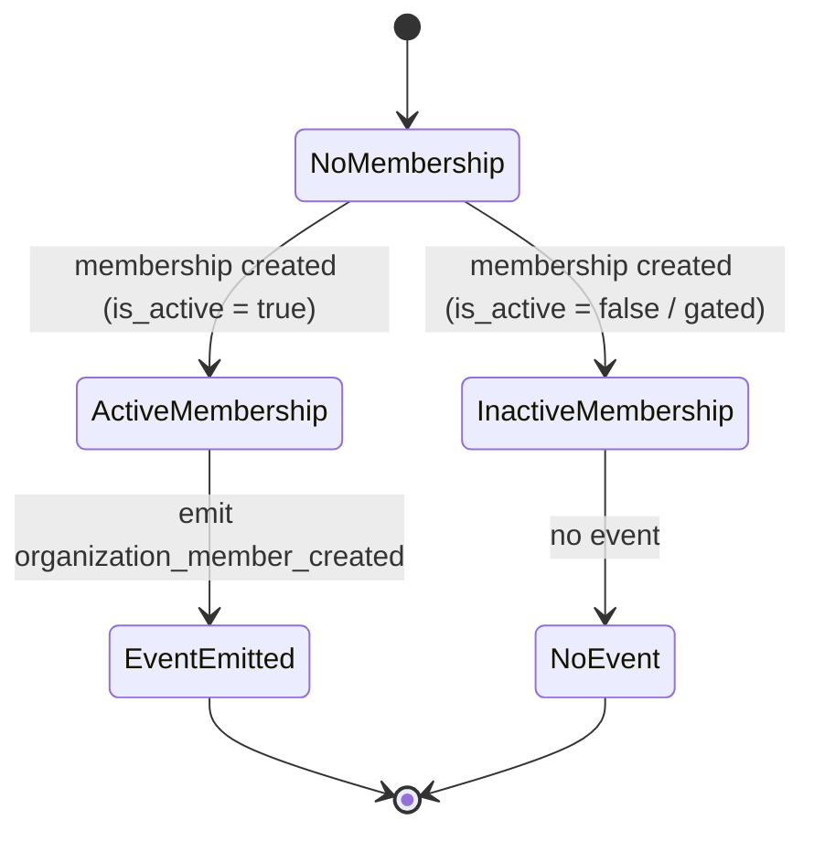

# organization_member_created Outgoing Webhook — Spec

> Requested as a "`user_created`" webhook. During the interview the trigger was resolved to **organization-membership creation** (the only point at which there is an organization to scope an org-scoped webhook to), so the event is named **`organization_member_created`**. The consuming Medplum bot still treats each delivery as "a new user to link."

## 1. Business Context

Vinta-Schedule is integrating with an external Medplum instance. A Medplum bot needs to create or link a **Provider** record for each person who starts operating inside an organization, and to mint a Medplum-scoped token for that Provider. To do that, the bot must learn — at the moment a person becomes part of an organization — the person's Vinta-Schedule identifier and which organization they belong to, so it can store the Vinta identifier on the Provider and key future calls off it.

Today there is no signal leaving Vinta-Schedule when a person joins an organization. The outgoing-webhook system already exists (configuration + delivery + retry), but it only emits calendar-event and attendee events; there is no user/membership event at all. Without this signal the Medplum side has no automated way to discover new people, so Provider creation and token minting would have to be done manually or by polling — neither of which exists.

The customer for this change is the **Medplum integration** (an external automated consumer), and secondarily the **integration/ops engineers** who configure the webhook endpoint per organization. Cost of doing nothing: the Medplum link cannot be automated at all — every new member would need manual Provider setup, which does not scale and blocks the broader Medplum rollout that depends on this hook.

This spec covers only the **outbound notification** and the webhook-management surface around it. The token-minting and Provider-linking logic lives entirely on the Medplum side and is out of scope here.

## 2. Hypothesis (to be validated)

Not a hypothesis — **known requirement** driven by the Medplum integration. The bar is correctness and the integration working end-to-end (the bot reliably receives one notification per new active membership, with enough data to link a Provider), not a metric to move. Objectives below are stated as definition-of-done.

## 3. Objectives (and definition of done)

1. **A new event type exists and is selectable.** An organization can configure a webhook subscription for `organization_member_created` exactly the way it configures calendar-event subscriptions today.
   - Signal: a webhook configuration can be created for the new event type and is accepted/stored.
   - Source: the webhook-configuration management surface (REST and GraphQL).
   - Done when: the new event type is a valid, documented choice and round-trips through create/read.

2. **The event fires exactly when a person becomes an active member of an organization.** One notification per (user, organization) active-membership creation; refires if the same user later joins a different organization.
   - Signal: creating an active membership produces one pending delivery per matching configuration; creating an inactive/gated membership produces none.
   - Source: the delivery records for the event.
   - Done when: the firing rule matches the State transitions & edge cases section with no extra or missing deliveries.

3. **The payload carries enough to link a Provider.** The delivered body lets the bot identify the user (Vinta identifier), the user's email, and the organization (id + name) and membership (role + id).
   - Signal: a received delivery contains every field listed in the Use-cases payload contract.
   - Source: the POST body received by the configured endpoint.
   - Done when: the field set matches the contract below, inside the new envelope.

4. **Delivery is reliable and de-duplicable.** Delivery reuses the existing at-least-once machinery (exponential backoff, up to the existing maximum retry count). Every delivery — first attempt and retries of the same logical event — carries a stable event id the bot can dedupe on, so a retried event never creates a second Provider.
   - Signal: retries of one logical event share one envelope id; distinct events have distinct ids.
   - Source: the envelope `id` across the retry chain.
   - Done when: the id is stable across the retry chain of a single logical event.

5. **Webhook configuration is manageable over GraphQL at parity with REST.** External integrations can create, read, update, and delete webhook configurations and read delivery history over the public GraphQL API, organization-scoped, without losing any capability that REST offers.
   - Signal: the same CRUD operations available over REST are available over GraphQL, under the same org-scoping and permissions.
   - Source: the public GraphQL schema.
   - Done when: CRUD parity holds and is org-scoped.

## 4. Decisions

### 4.1 Use-cases

1. **A user accepts an invitation and the Medplum bot links a Provider.**
   - Actor: an invited person (and the Medplum bot as downstream consumer).
   - Trigger: the person accepts an organization invitation, which creates an **active** membership in that organization.
   - Flow:
     1. The active membership is created in the organization.
     2. The system emits an `organization_member_created` event for that organization.
     3. For each webhook configuration in that organization subscribed to `organization_member_created`, one delivery is queued.
     4. The configured endpoint (the Medplum bot) receives a POST with the enveloped payload.
     5. The bot reads the Vinta user id, email, organization, and membership role, creates or links a Provider, mints a scoped token, and records the Vinta user id on the Provider for future correlation.
   - Outcome: the Provider is linked to the Vinta user id; the bot has everything it needs without calling back into Vinta-Schedule.

2. **A user creates a brand-new organization.**
   - Actor: a person signing up and starting their own organization.
   - Trigger: organization provisioning creates the person as an **active admin** member of the new organization.
   - Flow: same as above, from step 1; the membership role delivered is admin.
   - Outcome: one notification, role = admin, for the new organization.

3. **An existing user joins a second organization.**
   - Actor: a person who is already a member of organization A and is now added to organization B.
   - Trigger: an active membership is created in organization B.
   - Flow: same as use-case 1, scoped to organization B's configurations only.
   - Outcome: a second, independent notification for organization B; the bot links a Provider in B's context. Organization A receives nothing.

4. **Integration self-manages its webhook subscription over GraphQL.**
   - Actor: an integration engineer / automated setup for an organization.
   - Trigger: the integration creates (or updates/deletes) a webhook configuration for `organization_member_created` via the public GraphQL API.
   - Flow:
     1. The integration sends a GraphQL mutation to create a configuration with the endpoint URL and event type.
     2. The configuration is stored, organization-scoped to the caller's active membership.
     3. Subsequent member-created events in that organization deliver to the endpoint.
   - Outcome: the integration manages its own subscription without using REST.

**Payload contract (the `data` object inside the envelope):**

- `user_id` — the integer Vinta-Schedule User identifier; the value the bot stores on the Provider.
- `email` — the user's email.
- `organization_id` — the integer organization identifier.
- `organization_name` — the organization's name.
- `membership_role` — `member` or `admin`.
- `membership_id` — the integer membership identifier (membership identity for the bot's own deduplication if desired).

The payload deliberately **does not** include the user's profile name (see Open questions, item 1).

**Envelope contract (the top-level POST body, applied to every event type):**

- `id` — a stable identifier for the logical event, identical across every retry of that event and distinct between different events. The bot's idempotency key.
- `type` — the event-type string (e.g. `organization_member_created`).
- `timestamp` — when the logical event occurred.
- `data` — the event-specific object (for this event, the payload contract above).

### 4.2 State transitions & edge cases

**Firing rule (state machine):**

- **Only active memberships fire.** A gated/inactive membership creation emits nothing. If a person is later activated, that is when the signal should fire (see Open questions, item 2, for the activation-path detail).
- **Per (user, organization).** Each active membership creation is one logical event. The same user joining multiple organizations produces one event per organization.
- **No matching configuration → no delivery.** If an organization has no configuration subscribed to `organization_member_created`, the event produces no deliveries. A configuration created *after* a membership is created does **not** receive that past membership's event (no backfill).

**Edge cases and decided handling:**

- **User existed before any organization.** Users are created at signup before any membership. No event fires at signup — only at active-membership creation. Correct and intended.
- **Membership removed then re-created.** Re-creating an active membership is a new logical event with a new envelope id; the bot may create/link a Provider again. Accepted — re-joining is a genuine new event.
- **Inactive→active transition (re-activation of a gated membership).** Whether a later activation re-emits the event is an Open question (item 2); the baseline decision is that only the creation of an active membership fires, so a membership created inactive and later activated is a gap to resolve before implementation.
- **Same membership delivered more than once (retry).** Handled by idempotency below — same envelope id, bot dedupes.
- **Endpoint down / 5xx / timeout.** Handled by the existing retry machinery (below).

**Idempotency:**

- Delivery is **at-least-once**. The same logical event may arrive more than once (retries, redelivery). The bot must treat the envelope `id` as an idempotency key and make Provider creation/linking a no-op on repeat. Vinta-Schedule guarantees the envelope `id` is stable across the retry chain of one logical event and distinct between logical events.
- Vinta-Schedule does **not** dedupe on the bot's behalf; reliability is "deliver at least once with a stable id," not "deliver exactly once."

**Concurrency:**

- Two memberships created near-simultaneously in the same organization produce two independent events with distinct envelope ids; no shared state between them. No special concurrency resolution needed beyond the per-event isolation the existing delivery system already provides.

**Time-bounded behavior:**

- Retries follow the existing exponential-backoff schedule up to the existing maximum attempt count, after which the delivery is left failed and is available for manual retry through the existing event-management surface. No new TTL or expiry is introduced by this change.

### 4.3 Acceptance scenarios

1. **Happy path — invitation accepted.**
   Given an organization with a configuration subscribed to `organization_member_created`, when a person accepts an invitation and an active membership is created, then exactly one delivery is queued to the configured endpoint, and its body is an envelope `{id, type: "organization_member_created", timestamp, data}` whose `data` contains the user id, email, organization id, organization name, membership role, and membership id.

2. **Negative — gated membership does not fire.**
   Given the same configuration, when an inactive/gated membership is created, then no delivery is queued.

3. **Edge — same user joins a second organization.**
   Given organizations A and B each with a `organization_member_created` configuration, and a user already an active member of A, when an active membership for that user is created in B, then exactly one delivery is queued (to B's endpoint only) and none to A.

4. **Idempotency — retry carries a stable id.**
   Given a configured endpoint that returns a failing status on first attempt and success on retry, when an active membership is created, then both delivery attempts carry the same envelope `id`, so a correctly-implemented bot creates the Provider exactly once.

5. **Breaking-change visibility — calendar events are now enveloped.**
   Given an existing configuration subscribed to a calendar event, when that calendar event fires after this change ships, then the delivered body is the new envelope shape `{id, type, timestamp, data}` rather than the previous raw payload. (This is the intended breaking change — see Negative scope and Risks assumed.)

6. **Integration-driven — GraphQL config management.**
   Given an integration authenticated for an organization, when it creates a `organization_member_created` webhook configuration via the public GraphQL API, then the configuration is stored org-scoped to that integration's organization and subsequent member-created events in that organization deliver to its endpoint; and the same configuration is readable, updatable, and deletable over GraphQL.

### 4.4 Negative scope

- **Per-user / patient-scoped tokens** — separate, independently planned change that merely consumes this webhook. Not built here.
- **Single-use scheduling codes** — likewise separate and independently planned. Not built here.
- **Inbound Medplum→Vinta writeback** — the bot writing the minted token or Provider id back into Vinta-Schedule is a separate change; this spec is outbound-only.
- **Backfill of existing members** — the event fires only for memberships created after this ships. No event is emitted for users/memberships that already exist. Any backfill is a separate one-off operation.
- **HMAC / signature verification** — no payload signing or shared-secret signature header in this change. Envelope only.
- **Member updated / removed events** — only the created event ships now. `organization_member_updated` / `organization_member_deleted` are not part of this spec (see Open questions, item 3).
- **Profile name in the payload** — excluded for now (see Open questions, item 1).
- **New external UUID identifier** — the linking identifier is the existing integer user id; no new stable/public identifier column is introduced.

## 5. Alternatives considered

- **Trigger on User-row creation instead of membership creation.** Rejected: at signup there is no organization, and the webhook is organization-scoped, so there is nothing to scope the delivery to. It would force an artificial global/broadcast path. Membership creation is the first point with a concrete organization.
- **Introduce a new stable UUID/public identifier for users and send that.** Rejected for this spec: it is a schema change with its own migration and rollout, and the integer id already uniquely identifies the user for the bot's linking purpose. Can be revisited if pk exposure becomes a concern.
- **Email as the linking key.** Rejected: email is mutable and not a stable identifier; keying a Provider off it risks breakage on email change.
- **Envelope on the new event only, leaving calendar events raw.** Rejected by decision: the chosen end state is a single consistent enveloped shape across all event types, accepting the breaking change to existing calendar consumers rather than carrying two payload conventions forever.
- **Keep webhook configuration REST-only.** Rejected by decision: GraphQL CRUD parity was chosen so external integrations can self-manage subscriptions through the public GraphQL surface.

## 6. Open questions

1. **Should the payload include the user's profile (display) name?**
   - Recommended default: include first and last name, since a Provider typically needs a human name and omitting it may force the bot to call back or leave Providers unnamed.
   - Who can answer: Medplum integration owner.
   - Unblocks: finalizing the payload contract before implementation; currently the contract excludes it per the interview.

2. **Does a gated/inactive membership that is later activated emit the event on activation?**
   - Recommended default: yes — emit when the membership first becomes active, so a member created inactive and later activated is not silently skipped.
   - Who can answer: product owner for the membership lifecycle.
   - Unblocks: the firing rule for the inactive→active transition in State transitions & edge cases.

3. **Are member updated/removed events needed soon?**
   - Recommended default: defer; ship created-only now, revisit if the bot needs to react to role changes or removals.
   - Who can answer: Medplum integration owner.
   - Unblocks: whether to design the event-type set for extension now versus later.

4. **Is exposing the integer user id acceptable to the Medplum side and from an enumeration standpoint?**
   - Recommended default: acceptable — the endpoint is a trusted, org-scoped integration, not a public surface.
   - Who can answer: security reviewer + Medplum integration owner.
   - Unblocks: confirming no UUID identifier is needed (currently assumed not).

## 7. Risks assumed

- **Breaking existing calendar webhook consumers.** Assumption: switching all event types to the enveloped shape immediately is acceptable because any live consumer of the raw calendar payload can be coordinated with or there are none in production. If a live consumer parses the raw shape, it breaks on deploy. Mitigation: coordinate with any existing webhook consumers before rollout; if an unknown consumer surfaces, this is a one-way break requiring their fix. Likelihood: medium. Severity: high.
- **Duplicate Provider creation if the bot ignores the idempotency id.** Assumption: the bot dedupes on the envelope `id`. If it does not, at-least-once delivery will create duplicate Providers. Mitigation: document the idempotency contract clearly for the bot author; Vinta-Schedule guarantees id stability but cannot enforce bot behavior. Likelihood: low. Severity: medium.
- **Wrong firing semantics for gated memberships.** Assumption: only active-membership creation should notify. If gated users actually need early Provider creation, the bot will be missing them until activation. Mitigation: resolve Open questions item 2 before implementation. Likelihood: low. Severity: medium.
- **GraphQL CRUD broadens the attack/permission surface.** Assumption: reusing the existing org-scoped permission classes on the GraphQL fields is sufficient to keep configuration access correctly tenant-isolated. If the GraphQL permission wiring diverges from REST, an integration could read or write another organization's configurations. Mitigation: apply the same auth + organization-scope permission classes used by the REST surface and verify tenant isolation explicitly. Likelihood: low. Severity: high.
- **Integer id exposure.** Assumption: exposing sequential integer user/organization ids to the integration endpoint is acceptable. If pk enumeration is a concern for the integration's trust boundary, a stable opaque identifier would be needed instead. Mitigation: confirm via Open questions item 4; accepted for now. Likelihood: low. Severity: low.
- **Reversibility.** Adding the event type, the envelope, and the GraphQL surface is additive and removable, except the envelope change to existing event payloads, which is a customer-visible contract change (a one-way door once consumers adapt). Mitigation: treat the envelope cutover as the coordinated, irreversible part of the rollout. Likelihood: n/a. Severity: medium.
