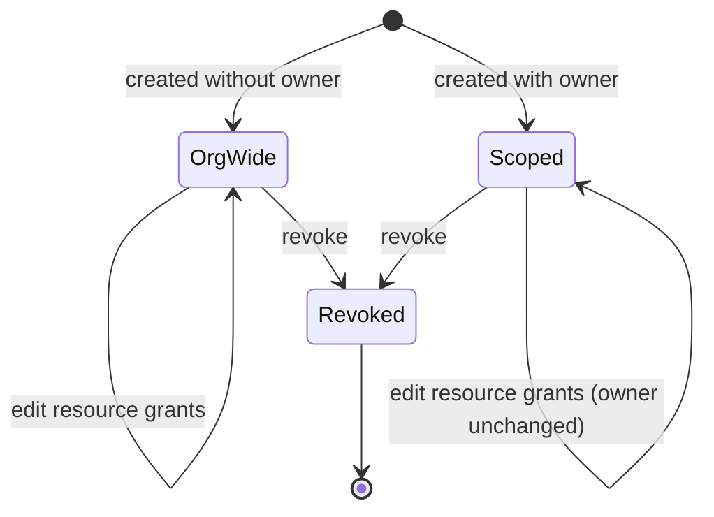

# Per-Owner-Scoped Public API Tokens — Spec

## 1. Business Context

Vinta-Schedule exposes a Public API (GraphQL + a small REST surface) consumed by external integrations. Today, access is controlled by two records: a system user (the integration's identity, carrying a long-lived token) and a set of resource grants that say which **resource types** (calendars, events, blocked times, available times, availability windows, users, etc.) that system user may touch. Both grants are **organization-wide**: any token that can read events can read **every** provider's events in the whole organization, and any token that can write can write anywhere in the organization.

The driver is a Medplum integration. A Medplum bot needs to mint a token, at the moment a provider (practitioner) user is created, that can manage **only that one provider's** scheduling data — their recurring availability, specific availability dates, blocked times, free/busy checks, listing their events and blocked times, and scheduling events on their calendar. The bot also needs a second, much narrower token shape for **patients**, able only to check availability and create appointments, and only when presenting a single-use scheduling code.

With the current model this is impossible without handing each provider's bot-minted token the keys to the entire organization. That is a least-privilege violation: a leaked or misbehaving provider token can read and modify every other provider's calendar in the org, and a patient-facing token would be even more dangerous. For a healthcare-adjacent integration this is both a security exposure and a compliance concern (one practitioner's token able to read another practitioner's patient appointments). There is no current safe path, so the integration cannot ship its per-provider and per-patient token model until the API can express per-owner scope.

Stakeholders: the Medplum integration owner (primary), platform security/compliance (must sign off on the scope-bypass surface), and any existing first-party consumers of the Public API whose org-wide tokens must keep working unchanged.

## 2. Hypothesis (to be validated)

Not a hypothesis — **known requirement** driven by the Medplum integration's least-privilege needs. The integration cannot safely issue per-provider or per-patient tokens until the Public API can scope a token to a single owner and enforce that scope on both reads and writes. Success is correctness and security (the scope cannot be bypassed), not a moved metric.

## 3. Objectives (and definition of done)

1. **A token can be scoped to exactly one provider.**
   - Signal: a scoped token, when querying or mutating, can only ever observe or change data belonging to its owner's calendars.
   - Source: integration test suite exercising the Public API with a scoped token against multi-provider fixtures.
   - Done when: every read returns only the owner's data and every cross-owner write is refused, across all in-scope resources.

2. **Existing org-wide tokens are unchanged.**
   - Signal: all current Public API behavior for unscoped tokens is byte-for-byte identical.
   - Source: existing Public API test suite passes without modification to expected outputs; the REST create contract for unscoped tokens is unchanged.
   - Done when: no regression in unscoped-token behavior and no data backfill was required.

3. **The Medplum bot can mint both token shapes.**
   - Signal: a single GraphQL mutation mints a provider-scoped token (owner + broad scheduling resource set) and a patient token (no owner, narrow code-gated resource set); the REST create endpoint can also mint a scoped token for admins.
   - Source: mutation/endpoint tests covering both shapes.
   - Done when: the bot can mint, the plaintext token is revealed exactly once, and the mutation is itself guarded so only an authorized caller can mint.

4. **The provider write capabilities exist.**
   - Signal: the provider token can manage recurring availability, specific availability dates, blocked times, and schedule events through public GraphQL mutations.
   - Source: mutation tests for each capability, run with a scoped token.
   - Done when: each capability is reachable and each is owner-enforced.

5. **The scope cannot be bypassed.**
   - Signal: a documented, reviewed enumeration of every field/mutation a scoped token can reach, each confirmed to filter or guard by owner.
   - Source: security review checklist completed against the implemented surface.
   - Done when: security sign-off on the bypass-surface review.

## 4. Decisions

### 4.1 Use-cases

1. **Bot mints a provider-scoped token on provider creation.**
   - Actor: Medplum bot, authenticated with an organization-wide token that has been granted the system-user resource.
   - Trigger: a provider user has just been created in Vinta-Schedule (the creation itself, and its triggering webhook, are out of scope — see Negative scope).
   - Flow:
     1. Bot calls the create-scoped-system-user mutation, passing the integration name, the owner reference (our internal provider user id), and the provider resource set.
     2. The API verifies the caller is authorized to mint and that the owner reference resolves to a user in the caller's organization.
     3. The API creates the system user with its owner set to that provider, persists the resource grants, and returns the plaintext token once.
     4. Bot stores the token against the provider in Medplum.
   - Outcome: a token that can read and write only that provider's scheduling data.

2. **Provider token manages its owner's availability and schedule.**
   - Actor: an automated client acting with a provider-scoped token.
   - Trigger: the provider's availability or schedule must be read or changed.
   - Flow:
     1. Client queries the provider's recurring availability, specific availability dates, blocked times, free/busy windows, events, or blocked-time list.
     2. The API confirms the token holds the relevant resource grant.
     3. The API filters every result to calendars owned by the token's owner.
     4. For writes (set recurring availability, add a specific available date, add a blocked time, schedule an event), the API confirms the target calendar is owned by the token's owner before applying the change.
   - Outcome: only the owner's data is ever returned or modified.

3. **Provider token attempts to reach another provider's data.**
   - Actor: a provider-scoped token (whether by integrator error or a compromised token).
   - Trigger: a query or mutation references a calendar, event, or object belonging to a different provider.
   - Flow:
     1. Client passes another provider's calendar id (or omits a filter, hoping to list across the org).
     2. The API derives the owner's calendar set and intersects the request against it.
     3. Reads return empty; writes return not-found.
   - Outcome: no data leaks and no cross-owner change; the existence of other providers' objects is not revealed.

4. **Bot mints a patient token.**
   - Actor: Medplum bot (same authorization as use-case 1).
   - Trigger: a patient-facing scheduling flow needs a token.
   - Flow:
     1. Bot calls the same mutation with no owner and the narrow patient resource set (availability check + appointment creation).
     2. The API creates a system user with no owner and only those grants.
     3. Returns the plaintext token once.
   - Outcome: a token that can do nothing on its own — every operation it can perform additionally requires a valid single-use scheduling code (designed separately).

5. **Patient token checks availability and books, gated by a single-use code.**
   - Actor: a patient client carrying a patient token.
   - Trigger: a patient wants to see open slots and book.
   - Flow:
     1. Client presents the patient token plus a single-use scheduling code in the request.
     2. While the code is unused, it authorizes reads of the specific resources it references (the slots being offered).
     3. When the client creates the appointment, the code is consumed and automatically revoked; it cannot be reused to read or write again.
   - Outcome: the patient token can only ever act within the envelope of a live, unconsumed code. (The code mechanism itself is out of scope here — see Negative scope.)

6. **Admin mints a scoped token via REST.**
   - Actor: an organization admin using the existing token-management REST endpoint.
   - Trigger: an admin wants a per-provider token without going through the bot.
   - Flow:
     1. Admin sends a create request including an optional owner reference and the resource set.
     2. With no owner, behavior is exactly as today (org-wide token). With an owner, the token is created scoped to that provider.
   - Outcome: scoping is available from REST too, while the unscoped path is unchanged.

### 4.2 State transitions & edge cases

**Token scope lifecycle**



- **Owner is immutable.** Once set at creation, a token's owner never changes. The grant-edit path may add or remove resource grants but must never repoint the owner. Re-scoping means revoke and re-mint. This keeps the scope-escalation surface small.
- **Owner reference must resolve within the caller's organization.** Minting with an owner that is not a user in the caller's organization is rejected; a token can never be scoped to a user outside its own org.
- **Deactivated or departed owner.** No cascade job is required. Enforcement re-derives the owner's calendar set on every request, so a provider who is deactivated or whose org membership ends naturally yields an empty accessible set — the scoped token's reads return empty and its writes return not-found. (An optional explicit auto-revoke is recorded under Open questions.)
- **Owner with no calendars yet.** A freshly created provider may own zero calendars. A scoped token then reads empty and can write only once a calendar it owns exists; this is expected, not an error.
- **Edge — list queries without a calendar filter.** Queries that would otherwise list across the organization (e.g. list events, list blocked times) must, for a scoped token, be constrained to the owner's calendars rather than returning the org-wide set. This is the most likely place to accidentally leak and must be explicitly enforced per resolver.
- **Edge — nested/expanded reads.** A returned object (e.g. an event) must not expose related objects belonging to other owners through field traversal. The bypass-surface review must include nested fields, not only top-level resolvers.
- **Idempotency of minting.** The integration name remains unique. A retry that reuses the same integration name is **rejected** (duplicate), not silently re-created, and the plaintext token is never re-revealed. The bot is expected to use a deterministic integration name per provider/patient and treat "already exists" as already-provisioned.
- **Idempotency of writes.** Existing write semantics are unchanged by scoping; scoping only narrows *which* targets a token may act on, it does not change the idempotency of the underlying operation.
- **Concurrency.** Two mint calls racing on the same integration name resolve to one winner and one duplicate-rejection via the existing uniqueness guarantee. Concurrent edits to a token's resource grants follow the endpoint's existing reconcile semantics; the owner field is never part of that reconcile.
- **Patient token without a code.** A patient token presented without a valid single-use code can do nothing — the code is what authorizes each read and the write. An unused code authorizes reads of the resources it references; consuming it on a write auto-revokes it.

### 4.3 Acceptance scenarios

1. **Happy — scoped read returns only the owner's data.**
   Given a provider-scoped token for provider A, and calendars owned by A and by B, when the token lists events/blocked times/available times, then only A's objects are returned and none of B's.

2. **Happy — scoped write succeeds on the owner's calendar.**
   Given a provider-scoped token for provider A, when it sets recurring availability / adds a specific available date / adds a blocked time / schedules an event on A's calendar, then the change is applied.

3. **Error — cross-owner write is refused.**
   Given a provider-scoped token for provider A, when it attempts to schedule an event or add a blocked time on B's calendar (by passing B's calendar id), then the API returns not-found and no change is made to B's data.

4. **Edge — cross-owner read is empty, not leaky.**
   Given a provider-scoped token for provider A, when it queries B's calendar id directly, then the response is empty and does not confirm that B's object exists.

5. **Integration — bot mints both shapes.**
   Given the bot's org-wide token with the system-user grant, when it calls the mutation once with an owner + provider resource set and once with no owner + patient resource set, then two tokens are created with the correct scope and resource sets, each plaintext token returned exactly once.

6. **Backward-compat — org-wide token unchanged.**
   Given an existing token created with no owner, when it performs any previously supported read or write, then behavior is identical to before this change.

7. **Security — mint is itself guarded.**
   Given a token that lacks the system-user grant, when it calls the mint mutation, then it is refused; and an owner reference outside the caller's organization is refused.

### 4.4 Negative scope

- **Single-use scheduling / rescheduling / cancelling codes — not built here.** The patient token depends on them, but they are independently planned. This spec only assumes their contract: an unused code authorizes reads of the resources it references and auto-revokes when consumed on a write.
- **The `user_created` outgoing webhook — not built here.** The bot's "mint on provider creation" trigger depends on it; it is separately planned. This spec starts from "a provider user exists and the bot has its id."
- **Provider/practitioner user creation itself — not built here.** Assumed to exist before minting.
- **Mutable owner / re-scoping in place — excluded.** Owner is immutable; re-scope is revoke + re-mint.
- **Re-revealing a token secret — excluded.** Plaintext is shown once at creation only; lost tokens are revoked and re-minted, never recovered.
- **Object-level / per-resource-different-owner scoping — excluded.** One token scopes to at most one owner across all its resources; a generic polymorphic scope table is explicitly not built.
- **Auto-revoke-on-owner-deactivation cascade — excluded for now** (see Open questions); enforcement already denies a deactivated owner's data without it.
- **Cross-organization scoping — excluded.** A token's owner must be in the token's own organization.
- **Changing the existing unscoped REST create contract — excluded.** The owner field is additive and optional; the no-owner path is held byte-for-byte.
- **CalendarGroup-pool scoping for patients — excluded.** Patient access is gated by codes, not by group membership.

## 5. Alternatives considered

- **Object-level scope rows on the resource-grant model.** Would let one token scope different resources to different owners. Rejected: more enforcement surface and more ways to misconfigure, with no use-case demanding per-resource owners. One owner per token covers both the provider and patient shapes.
- **A generic polymorphic scope table (owner, resource, object id).** Maximum flexibility. Rejected: largest blast radius, migration cost, and review surface for zero current need.
- **A second GraphQL mutation dedicated to patient tokens.** Would hard-code each token's allowed resource set, making misconfiguration harder. Rejected in favor of one parameterized mutation to minimize surface; the patient resource set will be constrained by validation instead. (Recorded as a residual risk under Risks assumed.)
- **Enforcing scope only in the permission class by inspecting field arguments.** Rejected: it cannot constrain list queries that return collections without a calendar argument, which are exactly the leak-prone cases. Filtering must happen where the queryset is built.
- **Auto-revoking scoped tokens when their owner is deactivated.** Cleaner audit trail. Deferred: enforcement already denies a deactivated owner's data by re-deriving calendars per request, so this is an optional hardening rather than a requirement.

## 6. Open questions

1. **Exact resource sets for each token shape.** Recommended default — provider: recurring availability (+ its recurring exceptions), specific available dates, blocked times (+ recurring exceptions), availability windows, unavailable windows, events (list + schedule); patient: availability windows + appointment creation only. Who answers: Medplum integration owner. Unblocks: finalizing validation on the mint mutation and the bypass-surface review checklist.
2. **Should minting be hardened to auto-revoke a scoped token when its owner is deactivated or leaves the org?** Recommended default: no (rely on per-request re-derivation). Who answers: platform security. Unblocks: deciding whether an owner-lifecycle signal/job is in scope.
3. **Should the single parameterized mint mutation enforce a fixed allow-list of resources per shape (provider vs patient), or accept any resource set the caller passes?** Recommended default: validate against a fixed per-shape allow-list so a caller cannot accidentally grant a patient token broad resources. Who answers: integration owner + security. Unblocks: mutation input validation design.
4. **Does the patient token need an owner at all in any flow?** Recommended default: no — patient tokens carry no owner and are gated entirely by codes. Who answers: integration owner. Unblocks: confirming the patient path needs no model scoping.

## 7. Risks assumed

- **Risk: a scoped read or write leaks across owners through a resolver that wasn't updated.** Assumption that fails it: that every in-scope field and nested field filters/guards by owner. Mitigation: two-layer enforcement (permission gate + resolver/service owner filter) plus a security review enumerating every reachable field; empty-on-read / not-found-on-write semantics so a missed filter is less likely to confirm existence. Likelihood medium, severity high.
- **Risk: the parameterized mint mutation lets a caller over-grant a patient token (broad resources on a code-gated token).** Assumption that fails it: that callers pass correct resource sets. Mitigation: per-shape resource allow-list validation (Open questions item 3). Likelihood medium, severity high.
- **Risk: the mint mutation itself becomes a privilege-escalation vector** (a lesser token mints a broader one). Assumption: that minting is gated by the system-user grant and owner-must-be-in-org checks. Mitigation: guard the mutation with the same authentication + resource check as today and reject out-of-org owners; include the mint path in the security review. Likelihood low, severity high.
- **Risk: building the missing provider write mutations introduces unscoped write paths.** Assumption: that each new mutation is owner-guarded from the start. Mitigation: owner-guard is an acceptance criterion for each new mutation, not a follow-up. Likelihood medium, severity high.
- **Risk: a deactivated provider's token behaves surprisingly** (silently returns empty rather than failing loudly), confusing integrators. Assumption: that empty/not-found is acceptable behavior for a dead owner. Mitigation: document the behavior; revisit auto-revoke (Open questions item 2). Likelihood low, severity low.
- **Risk: backward-compat regression for existing org-wide tokens.** Assumption: that a null owner reproduces today's behavior exactly and no backfill is needed. Mitigation: keep the unscoped path on the existing code where possible; assert no expected-output changes in the existing suite. Likelihood low, severity high (a regression here breaks live integrations). Reversibility: the owner field is additive and nullable, so the schema change is low-risk to roll back if nothing has been scoped yet; once scoped tokens exist in production, rollback would strand them and is effectively a one-way door.
```