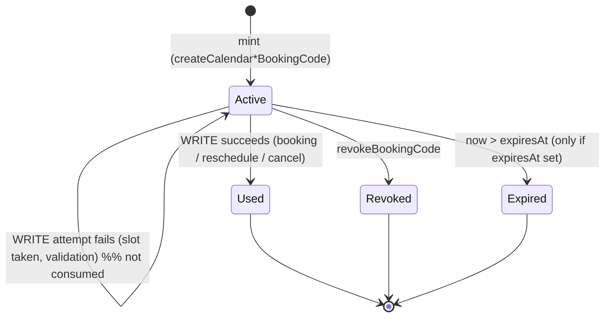

# Single-Use Scheduling Codes (Public GraphQL API) — Spec

## 1. Business Context

The Building Blocks patient portal (built on Medplum) is integrating with Vinta-Schedule so
clinics can manage providers, resources, and appointments in one place. In that integration,
**patients are never authenticated against Vinta-Schedule** — they live in the patient portal,
not in our identity system. Yet they must be able to book, reschedule, and cancel real
appointments that land on a provider's calendar.

Most provider/admin booking flows are reachable today with an organization-wide Public API
token. Patient flows are not: a patient has no token, and the calendars they book against are
**restricted** (a separately-planned `is_private` flag will mark calendars, calendar-groups,
and bundles as not openly bookable). Without a credential a patient can present, there is no
safe way to let them write to a restricted calendar — the only alternatives today are handing
out an org-wide token (unacceptable: it grants the whole organization's data) or leaving
patient self-service unbuilt (the integration cannot ship).

The mechanism the integration design calls for is a **single-use scheduling code**: a provider
or admin mints a short opaque code bound to a specific calendar/group (for new bookings) or a
specific existing event (for reschedule/cancel), hands it to a patient through the portal, and
the patient presents that code on an otherwise-unauthenticated mutation to perform exactly one
action.

The data model for this mostly exists already: `CalendarManagementToken` (with
`token_hash`, `used_at`, `revoked_at`, and calendar / event / external-attendee scope), the
`CalendarManagementTokenPermission` rows (create, update_attendees, update_self_rsvp,
update_details, cancel, reschedule), and `CalendarPermissionService` token-creation/validation
helpers. **The gap is purely the Public GraphQL surface**: mutations to mint standalone codes,
mutations to act with a code without an org token, code-gated availability reads, and a revoke
path.

Stakeholders who can block rollout if not looped in: the Building Blocks / Medplum integration
team (consumes every mutation here), clinic security/compliance owners (unauthenticated write
paths touch PHI-adjacent scheduling data), and the team building the separate `is_private`
restricted-visibility flag (this feature assumes that flag exists and is the thing codes
unlock).

Cost of doing nothing: the patient-portal booking, reschedule, and cancel screens cannot be
built, which blocks the Building Blocks integration from going live for any restricted
calendar — i.e. the primary clinical use case.

## 2. Hypothesis (to be validated)

Not a hypothesis — **known requirement** driven by the Building Blocks / Medplum integration.
Unauthenticated patients cannot write to restricted calendars without a presentable, scoped,
single-use credential; the portal's booking/reschedule/cancel screens have no API to call until
this ships. Correctness, scope-tightness, and security of the unauthenticated path matter;
there is no metric to validate or roll back against.

## 3. Objectives (and Definition of Done)

1. **A provider/admin can mint a single-use code** for each supported action.
   - Signal: the mint mutations (`createCalendarBookingCode`,
     `createCalendarGroupBookingCode`, `createCalendarRescheduleBookingCode`,
     `createCalendarGroupRescheduleBookingCode`, `createCalendarCancellationBookingCode`,
     `createCalendarGroupCancellationBookingCode`) exist on the Public GraphQL schema, are
     gated by the existing org-token auth, and return a usable plaintext code exactly once.
   - Definition of done: integration test mints each code type with an org token and asserts a
     code string is returned and a corresponding `CalendarManagementToken` row with the correct
     scope and permission set exists.

2. **An unauthenticated patient can act with a code** without any org token.
   - Signal: the with-code mutations (`createCalendarEventWithCode`,
     `createCalendarGroupEventWithCode`, `rescheduleCalendarEventWithCode`,
     `rescheduleCalendarGroupEventWithCode`, `cancelEventWithCode`) succeed when the request
     carries **no** `IsAuthenticated` system user, authorized solely by a valid code.
   - Definition of done: integration tests perform each action with only a code and assert the
     event is created/rescheduled/cancelled, and assert the same call **without** a code (or
     with a code carrying the wrong permission/scope) is rejected.

3. **A code is single-use on write and cannot be replayed.**
   - Signal: a second successful write with the same code fails with `ALREADY_USED`.
   - Definition of done: test that a code consumed by a successful write rejects any later
     write; test that a write that *fails for another reason* (e.g. slot taken) does **not**
     consume the code.

4. **A patient can read the availability they need to choose a slot, using the code.**
   - Signal: code-gated read queries (availability/bookable-slots for the bound calendar/group;
     reading the bound event for reschedule/cancel) return data when presented a valid code and
     no org token.
   - Definition of done: tests that a booking code authorizes availability reads for its bound
     calendar/group only, and that reads do not consume the code.

5. **An unused code can be revoked.**
   - Signal: `revokeBookingCode` (org-token-gated) marks a code revoked; subsequent use fails
     with `REVOKED`.
   - Definition of done: test mint → revoke → use-fails-with-REVOKED.

6. **A code cannot reach data outside its scope or organization.**
   - Signal: a code bound to calendar A cannot book calendar B; a code from organization X
     cannot touch organization Y; a reschedule code for event E cannot cancel event F.
   - Definition of done: cross-scope and cross-organization negative tests for every with-code
     mutation and every code-gated read.

## 4. Decisions

### 4.1 Use-cases

**Use-case 1 — Provider mints a booking code for a restricted calendar.**
- Actor: provider/admin (holds an org Public API token granted the new booking-code resource).
- Trigger: a patient needs to book with a specific provider whose calendar is restricted.
- Flow:
  1. Caller invokes `createCalendarBookingCode` with the calendar id (a personal, resource, or
     `BUNDLE` calendar) and optional `expiresAt`.
  2. The system creates a `CalendarManagementToken` scoped to that calendar with the `create`
     permission and returns the plaintext code once.
  3. Caller (via the Medplum bot / portal) delivers the code to the patient.
- Outcome: a single-use create-scoped code exists, bound to that calendar, ready for the
  patient.

**Use-case 2 — Patient books an appointment with a code.**
- Actor: unauthenticated patient (in the Building Blocks portal).
- Trigger: patient has a booking code and chose a time.
- Flow:
  1. Portal (optionally) calls a code-gated availability read to render open slots for the
     bound calendar/group.
  2. Patient picks a slot; portal calls `createCalendarEventWithCode` with the code, the
     start/end/timezone, and the patient's `externalAttendee { email, name }`.
  3. The system validates the code (active, not expired, not used, `create` permission,
     calendar scope), creates the event with the patient as an external attendee, and marks the
     code used.
- Outcome: a real `CalendarEvent` exists on the provider's calendar; the code is consumed; the
  portal stores the returned event id against its Appointment.

**Use-case 3 — Provider mints a reschedule (or cancel) code for one event.**
- Actor: provider/admin with an org token.
- Trigger: a patient must move or cancel an existing appointment they cannot otherwise reach.
- Flow:
  1. Caller invokes `createCalendarRescheduleBookingCode` (or the cancel / group variants) with
     the calendar (or group) id, the specific `eventId`, and optional `expiresAt`.
  2. The system creates a token scoped to that **event** with the `reschedule` (or `cancel`)
     permission and returns the code once.
  3. Caller delivers the code to the patient.
- Outcome: a single-use, event-bound code ready for exactly one reschedule or cancel.

**Use-case 4 — Patient reschedules or cancels with a code.**
- Actor: unauthenticated patient.
- Trigger: patient holds a reschedule or cancel code for their appointment.
- Flow:
  1. For reschedule, portal optionally calls a code-gated availability read for the event's
     calendar/group to render new slots.
  2. Portal calls `rescheduleCalendarEventWithCode` (new start/end/timezone) or
     `cancelEventWithCode` (code only).
  3. The system validates the code against the bound event and permission, performs the action,
     and marks the code used.
- Outcome: the event is moved or cancelled; the code is consumed.

**Use-case 5 — Provider revokes an unused code.**
- Actor: provider/admin with an org token.
- Trigger: code was sent in error, patient no longer needs it, or it leaked.
- Flow:
  1. Caller invokes `revokeBookingCode` identifying the code.
  2. The system sets `revoked_at`.
- Outcome: any later use of that code fails with `REVOKED`.

**Integration-driven note:** every actor on the mint/revoke side is in practice a Medplum bot
calling with an org token, and every patient-side call is the portal backend relaying a code.
There is no human-in-a-browser assumption on either side; flows must behave for machine callers
(deterministic errors, idempotent reads, single-use writes).

### 4.2 State transitions & edge cases

**Code lifecycle**

- **States:** `Active` (mintable default), `Used` (`used_at` set), `Revoked` (`revoked_at`
  set), `Expired` (only reachable when an `expiresAt` was supplied at mint and has passed).
- **Forbidden transitions:** `Used`/`Revoked`/`Expired` are terminal — no write succeeds from
  them. A `Used` code may not be re-activated; a new action requires a new code.

**"Used" semantics (consumption rule):** a code is **reusable for reads and single-use on the
first successful write**. Presenting a code to a code-gated read query never sets `used_at`.
A write mutation sets `used_at` **only when the underlying action succeeds**. A write that fails
for any other reason (invalid slot, slot already taken, business-rule rejection) leaves the code
`Active` so the patient can retry. This is the explicit choice over "burn on first attempt".

**Expiry:** codes **do not expire unless `expiresAt` is supplied at mint**. When supplied, a
code past `expiresAt` is treated as `Expired` and rejected with `EXPIRED`. There is no default
TTL; single-use + revocation are the primary controls.

**Binding rules:**
- A **booking** code binds to a **calendar or a calendar-group**. Bundles are calendars with
  `calendar_type=BUNDLE`; they are booked through the calendar-shaped mutations (no separate
  bundle mint mutation). There is **no AppointmentType entity** in the system, so the proposed
  `appointmentTypeId` argument is dropped from scope; a code binds to the calendar/group itself.
- A **reschedule** or **cancel** code binds to a **single specific event**. The event must
  belong to the calendar/group named at mint time; minting against a mismatched event is
  rejected at mint.

**Idempotency:**
- **Reads** are idempotent (repeatable, no side effect).
- **Writes** are single-use, not idempotent-by-retry: the first success consumes the code, so a
  replay of the same successful call returns `ALREADY_USED` rather than performing the action
  again. (The portal is expected to treat `ALREADY_USED` after a network-ambiguous success as
  "already done" and reconcile via the stored event id.)

**Concurrency:** two patients (or two retries) presenting the **same** code to a write
simultaneously must result in **at most one** successful action — atomic first-write-wins on
consumption. The loser receives `ALREADY_USED`. Consumption and the action commit together so a
code cannot be marked used without its action landing, nor an action land twice.

**Cross-scope / cross-organization:** a code is organization-scoped; the organization is
resolved **from the code**, not from a token or header. A code may only act on the calendar /
group / event it is bound to, within its own organization. Any attempt to use it against another
calendar, event, or organization is rejected as if the code were invalid for that target.

**Time-bounded behavior:** the only time rule is `expiresAt` when set (above). There is no soak
window or scheduled re-evaluation.

### 4.3 Acceptance scenarios

1. **Happy — mint then book (restricted calendar).**
   Given an org token granted the booking-code resource and a restricted calendar, when the
   caller mints a `createCalendarBookingCode` and an unauthenticated patient calls
   `createCalendarEventWithCode` with that code and a valid slot and their email/name, then an
   event is created on the calendar with the patient as external attendee, the code becomes
   `Used`, and the result carries `success: true` and the new event.

2. **Error — replayed code.**
   Given a booking code already consumed by a successful booking, when a second
   `createCalendarEventWithCode` is sent with the same code, then the result is
   `success: false` with error `ALREADY_USED` and no second event is created.

3. **Error — wrong permission / scope.**
   Given a **cancel** code bound to event E, when it is presented to
   `rescheduleCalendarEventWithCode` (or used to cancel a different event F), then the result is
   `success: false` with error `NOT_PERMITTED` (wrong permission) or `INVALID_CODE` (wrong
   target) and no change occurs.

4. **Edge — failed write does not consume.**
   Given an active booking code, when `createCalendarEventWithCode` is called for a slot that is
   already taken, then the result is `success: false` (slot-unavailable error) and the code
   remains `Active`, so a subsequent call for a free slot succeeds.

5. **Edge — expiry honored only when set.**
   Given a code minted with `expiresAt` in the past, when used, then the result is
   `success: false` with `EXPIRED`; given a code minted with no `expiresAt`, when used after a
   long delay, then it still works (subject to single-use/revocation).

6. **Integration-driven — code-gated availability read, no org token.**
   Given a valid booking code and **no** authenticated system user, when the portal calls the
   code-gated availability read for the bound calendar/group, then open slots are returned, the
   code is **not** consumed, and the same read for a *different* calendar (not the code's bound
   one) returns no authorization.

7. **Happy — revoke before use.**
   Given a freshly minted, unused code, when the provider calls `revokeBookingCode` and the
   patient then attempts to use it, then the use fails with `REVOKED`.

### 4.4 Negative scope

- **Patient portal UI** — not built here; this spec is the API only.
- **The `is_private` / restricted-visibility flag** on `Calendar`, `CalendarGroup`, and bundle
  calendars — separate, independently-planned change. This spec **assumes that flag exists** and
  designs codes as the mechanism that unlocks booking on restricted entities; it does not create
  the flag.
- **Per-user / patient-scoped Public API tokens** (the scoped-`SystemUser` work) — separate
  spec. Codes here are standalone credentials, not tokens, and do not depend on that change.
- **The `user_created` outgoing webhook** — separate spec; unrelated to codes.
- **An AppointmentType entity / `appointmentTypeId`** — no such model exists; deliberately not
  introduced. Booking codes bind to the calendar/group directly.
- **Bundle-specific mint mutations** — bundles are booked via the calendar-shaped mutations; no
  `createCalendarBundleBookingCode` etc.
- **Booking codes that later reschedule/cancel the same appointment** — out of scope; reschedule
  and cancel each require their own provider-minted, event-bound code (one code, one action).
- **Per-IP throttling / failed-attempt lockout** — not added; abuse control reuses the existing
  per-organization rate limiter keyed on the org resolved from the code (see **Risks assumed**).
- **Changing the existing authenticated provider mutations** (`createCalendarEvent`,
  `createCalendarGroupEvent`, `rescheduleCalendarEvent`, etc.) — their contracts stay as-is;
  the with-code variants are additive.

## 5. Alternatives considered

- **Hand patients an org-wide (or even resource-scoped) Public API token.** Rejected: an org
  token exposes the whole organization's scheduling data; even a resource-scoped token is not
  bound to one calendar/event or to a single action, so it over-grants and cannot be made
  single-use.
- **Build patient-scoped tokens first and route patient booking through them.** Rejected for
  this scope: patient-scoped tokens are a separate, larger change, and even with them the
  *restricted* calendars still need a per-action, single-use, mintable-and-revocable credential.
  Codes are the narrower primitive the integration design asked for; the token work proceeds in
  parallel.
- **Make restricted calendars publicly bookable behind a shared secret URL.** Rejected: a shared
  secret is not single-use, not per-action, not revocable per-patient, and not auditable to one
  booking.
- **Burn the code on first write attempt (success or failure).** Rejected: a transient failure
  (slot taken, network) would strand the patient with a dead code and force the provider to
  re-mint; reusable-read + single-use-on-success is friendlier and still safe.

## 6. Open questions

1. **Exact set of code-gated read queries.** Recommended default: a booking code authorizes
   `availableTimes` / `availabilityWindows` / `unavailableWindows` for its bound calendar and
   `calendarGroupAvailability` / `calendarGroupBookableSlots` for its bound group; a
   reschedule/cancel code authorizes reading its bound event (and that event's
   calendar/group availability for reschedule). Who can answer: integration team (which portal
   screens read what). Unblocks: the read-side phase of the plan.
2. **Whether `revokeBookingCode` identifies a code by the plaintext code, by an opaque code id
   returned at mint, or both.** Recommended default: return an opaque `id` alongside the
   plaintext `code` at mint and revoke by `id` (so the plaintext need not be retained by the
   minter). Who can answer: API owner. Unblocks: the mint/revoke result shape.
3. **Whether code-gated reads should also be limited to restricted (`is_private`) targets, or
   work for any calendar/group a code is bound to.** Recommended default: a code authorizes
   reads for its bound target regardless of that target's privacy (the binding is the gate).
   Who can answer: security owner once `is_private` lands. Unblocks: read-authorization tests.
4. **Audit expectations for code usage** (who minted, who consumed, source IP). Recommended
   default: persist minter (system user), `used_at`, and request IP on the token; no new
   audit-log surface. Who can answer: compliance owner. Unblocks: the model/migration phase.

## 7. Risks assumed

- **Unauthenticated write path is a new attack surface.** Assumption: an opaque,
  high-entropy, hashed-at-rest code (the existing `token_urlsafe(32)` + SHA-256 scheme) plus
  single-use semantics makes guessing or replay infeasible. Mitigation: keep codes opaque,
  compare in constant time, and return the same machine-readable errors for "wrong target" as
  for "unknown code" so the surface does not leak which codes exist. Likelihood low / severity
  high if wrong.
- **Per-organization rate limiting may be weak for unauthenticated abuse.** Assumption: keying
  the existing limiter on the org resolved from the code is sufficient because a valid code is
  required to resolve an org at all, so anonymous floods without a code never reach the limiter
  scope. Mitigation: accepted for v1; a per-IP throttle or failed-attempt lockout can be added
  later if abuse appears (called out in **Negative scope**). Likelihood medium / severity
  medium.
- **Depends on the `is_private` flag landing.** Assumption: the restricted-visibility flag ships
  with semantics that make "restricted ⇒ requires a code to book" enforceable. If that flag's
  semantics differ, the gating story changes. Mitigation: design the code path to authorize an
  action on its bound target independently of the flag, so codes work even before/without the
  flag; the flag only decides whether the *codeless* public path is allowed. Likelihood medium /
  severity medium.
- **Consume-and-act atomicity under concurrency.** Assumption: marking a code used and committing
  its action can be done in one transaction with row-level locking so a code cannot double-book.
  Mitigation: explicit first-write-wins test in the acceptance matrix. Likelihood low / severity
  high.
- **Reversibility.** Adding mutations and a (likely small) model change is additive and
  reversible by removing the GraphQL fields and the new `PublicAPIResources` value; no existing
  contract changes. Any new column on `CalendarManagementToken` is nullable/additive. Low-risk
  one-way exposure: once the unauthenticated mutations are public, integrators will depend on
  them, so their input/result shapes should be treated as a committed contract from launch.
