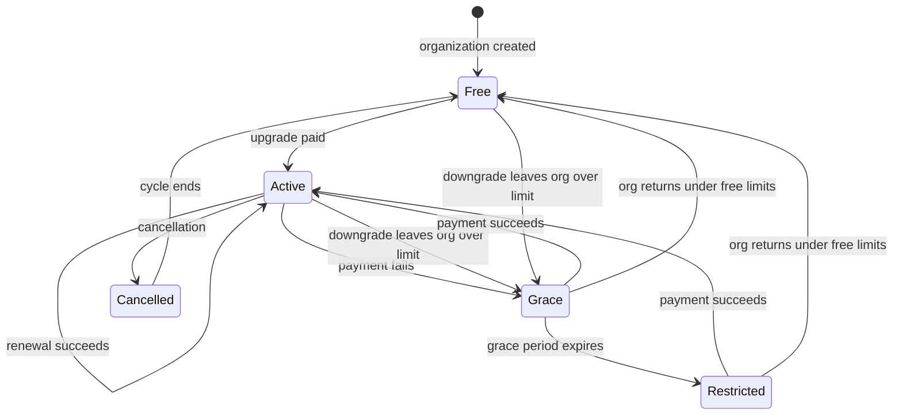

# Billing Plans and Limits — Spec

## 1. Business Context

The product has a payment module and one payment provider integration, but nothing in the product charges anyone or restricts anyone. Every organization today has unlimited use of every resource: unlimited members, unlimited rooms and resource calendars, unlimited calendar groups, unlimited scheduled events, unlimited access to every integration and to the partner API. There is no plan, no limit, no counter, and no link between an organization and a subscription.

This is pre-launch infrastructure. We are not trying to convert an existing base of free users — we are building the commercial layer that has to exist before we open signups. The cost of not doing it is that we cannot launch: there is no way to take money, no way to distinguish a paying organization from a non-paying one, and no ceiling on the third-party and infrastructure cost a single organization can impose on us.

Stakeholders: product and sales (who set the tiers and prices, which this spec deliberately does not fix), engineering (who own the enforcement surface and the provider integration), and support (who will field every "why am I blocked" conversation this feature creates). The reseller side of the business also cares — organizations can invite child organizations, and the billing model has to say who pays for a child.

Two facts about the current code shape the work and are stated here because they are business constraints, not implementation detail. First, billing today attaches to a **user**, not an organization — the billing profile is one-per-user and the subscription record has no organization link at all. Second, the existing plan, tier, and subscription models are partly orphaned and partly broken: nothing creates them, nothing reads them for behavior, and the code that was meant to connect a subscription to an organization does not work. Nothing is live on them, so there is no production data to protect, but the connection has to be built and repaired before anything else can stand on it.

## 2. Hypothesis (to be validated)

Not a hypothesis — **known requirement**, driven by the need to charge for the product before public launch. There is no version of this where we ship the product without a billing and entitlement layer, and no metric that would cause us to roll it back.

The specific tiers, limits, and prices *are* provisional and will be iterated on, but they are seeded data rather than product behavior. This spec describes the mechanism; it does not fix the numbers.

## 3. Objectives (and definition of done)

Because this is a known requirement rather than a hypothesis, the objectives below are stated as definition-of-done conditions with concrete verification, not as metrics to validate.

1. **No unmetered path exists.**
   Every creation path for a limited resource is behind an enforcement check — the internal REST surface, the public partner API, and background sync and import paths.
   *Signal:* test coverage asserting that each limited resource type is blocked at its limit through each of those three entry points.
   *Threshold:* zero resource types with an unguarded creation path.
   *Timeframe:* before launch.

2. **A free organization can self-serve upgrade, end to end.**
   An organization on the free plan can choose a paid plan, pay successfully, and observe its limits lift, without any support or engineering intervention.
   *Signal:* the flow completed against the provider's sandbox and then once in production.
   *Threshold:* completes without manual steps.
   *Timeframe:* before launch.

3. **Overage bills correctly across a full cycle.**
   A billing cycle closes with post-paid usage metered, charged, and reconciled against the payment provider with no drift between what we counted and what we charged.
   *Signal:* a reconciliation comparison between internally recorded usage and provider-side charges for a closed cycle.
   *Threshold:* zero unexplained discrepancies.
   *Timeframe:* first full cycle after launch.

4. **Zero impact on existing organizations at rollout.**
   Every organization that exists when this ships is placed on a plan without any of its current workflows breaking or being blocked.
   *Signal:* no organization enters a blocked or restricted state as a direct result of the rollout itself.
   *Threshold:* zero.
   *Timeframe:* at rollout, and for the grace window following it.

## 4. Decisions

### 4.1 Use-cases

**Use-case 1 — New organization lands on the free plan.**
- *Actor:* any user creating an organization.
- *Trigger:* organization creation.
- *Flow:*
  1. The organization is created.
  2. It is placed on the free plan automatically — no plan selection step, no payment method required.
  3. Its limits and feature entitlements are those of the free plan.
- *Outcome:* every organization always has exactly one active plan. There is no plan-less state.

**Use-case 2 — Organization hits a pre-paid limit and is blocked.**
- *Actor:* an organization admin.
- *Trigger:* inviting a member when the organization is already at its seat limit.
- *Flow:*
  1. The admin submits the invitation.
  2. Enforcement finds the organization at its seat limit.
  3. The invitation is rejected. Nothing is created.
  4. The error names the limit that was hit, the current usage, the ceiling, and that the way forward is to buy more seats or upgrade.
- *Outcome:* the admin knows exactly what blocked them and what to do about it. The same applies to rooms, calendar groups, and other pre-paid resources.

**Use-case 3 — Organization buys more of a pre-paid resource.**
- *Actor:* an organization admin, the billing owner, or the parent reseller.
- *Trigger:* choosing to buy additional capacity after being blocked, or ahead of needing it.
- *Flow:*
  1. The purchaser selects the resource and quantity.
  2. They choose either a recurring add-on (billed every cycle until removed) or a one-time pack, depending on what that resource offers.
  3. Payment is taken through the provider.
  4. On confirmed payment, the organization's effective limit for that resource rises.
- *Outcome:* the previously blocked action now succeeds. The effective limit is the plan's limit plus purchased add-ons.

**Use-case 4 — Organization exceeds its included events and accrues overage.**
- *Actor:* any member scheduling events; also integrations and sync.
- *Trigger:* an event occurrence happens beyond the plan's included allowance for the cycle.
- *Flow:*
  1. The occurrence is metered as it happens.
  2. The organization has a payment method on file, so the occurrence is allowed.
  3. It accrues at the per-unit overage rate for that plan.
  4. At cycle close, accrued overage is charged alongside the recurring fee.
- *Outcome:* scheduling is never interrupted for an organization that can be billed. If the organization has **no** payment method on file, it is blocked at the included allowance instead of accruing.

**Use-case 5 — Payment fails and the organization degrades.**
- *Actor:* the system.
- *Trigger:* a failed recurring charge, or a downgrade that leaves the organization above its new limits.
- *Flow:*
  1. The organization enters a grace period and is warned.
  2. Dunning retries the payment across the grace window, with escalating notification.
  3. If the grace period expires unresolved, the organization becomes restricted.
  4. Restricted means writes are blocked and background calendar sync is paused for that organization.
  5. Existing data stays intact and readable throughout.
- *Outcome:* non-paying organizations stop generating third-party cost for us, without losing their data.

**Use-case 6 — Reseller pays for its children.**
- *Actor:* a reseller organization.
- *Trigger:* a child organization consumes a limited resource.
- *Flow:*
  1. Consumption by the child resolves against the reseller's plan and pooled limits, not against a plan of the child's own.
  2. The reseller holds the payment method and receives the charges.
  3. The reseller may purchase and change plans on a child's behalf.
- *Outcome:* one commercial relationship per reseller tree; children consume from a shared pool.

**Use-case 7 — Integration-driven consumption through the partner API.**
- *Actor:* an external integration authenticated against the public partner API.
- *Trigger:* the integration creates events or other limited resources.
- *Flow:*
  1. The request resolves to an organization.
  2. The same enforcement applies as for a human-initiated action.
  3. Over a pre-paid limit, the request is rejected with the same structured over-limit error.
  4. Post-paid consumption accrues identically.
- *Outcome:* the partner API is not a bypass. Neither is background sync or import.

**Use-case 8 — Organization inspects its usage.**
- *Actor:* an organization admin or billing owner.
- *Trigger:* wanting to know where they stand.
- *Flow:*
  1. They read current usage against effective limits, per resource.
  2. As usage approaches a limit, they are proactively warned before being blocked.
- *Outcome:* being blocked is never the first signal that a limit exists.

### 4.2 State transitions and edge cases

**Organization billing lifecycle**

- **Free** — on the free plan. Free limits apply. Pre-paid limits hard-block. Post-paid is blocked at the allowance because there is no payment method.
- **Active** — on a paid plan with billing in good standing.
- **Grace** — payment failed or the organization is above its limits after a downgrade. Warned, dunning in progress, still fully functional.
- **Restricted** — grace expired unresolved. Writes blocked, background calendar sync paused, data readable.
- **Cancelled** — cancellation requested; the plan runs to the end of the paid cycle, then falls back to free.

**Enforcement rules**

- **Pre-paid resources** (members/seats, rooms and resource calendars, calendar groups, and similar): hard block at the effective limit, with an error naming the limit, the current usage, the ceiling, and the upgrade or purchase path. Nothing is partially created.
- **Post-paid resources** (event occurrences): never blocked when a payment method is on file — usage accrues and bills on the next cycle. Blocked at the included allowance when no payment method is on file.
- **Effective limit** = the plan's limit for that resource, plus any purchased add-ons, resolved at the reseller root for organizations inside a reseller tree.
- **Feature entitlements** are boolean rather than numeric and gate: which external calendar integrations may be connected, whether the partner API may be used at all, white-label and branding capabilities, and advanced scheduling capabilities such as booking policies and resource allocation.
- **Enforcement points**: service-layer creation for every limited resource, the public partner API, and background sync and import paths. Administrative and internal support tooling deliberately bypasses enforcement — support must be able to fix an organization that is stuck.

**Counting**

- Pre-paid resources are counted **point-in-time**: the limit applies to what exists now. Deleting a member frees a seat immediately for enforcement purposes.
- Post-paid event usage is counted **per occurrence, metered as the occurrence happens**. A recurring series is not charged upfront for all of its occurrences. An open-ended weekly series therefore contributes roughly four occurrences per cycle, indefinitely, rather than an unbounded charge at creation.
- Usage resets per billing cycle for post-paid resources. Pre-paid resources have no reset — they are a standing count.

**Idempotency**

- Purchases are idempotent: a retried or duplicated purchase request must not grant capacity twice or charge twice.
- Provider webhooks are idempotent: the same provider event delivered more than once produces the same final state.
- Metering an occurrence is idempotent per occurrence: re-processing must not double-count. An occurrence is billed at most once, ever.

**Concurrency**

- Pre-paid limit checks are transactional. When two actors race for the last unit of capacity, exactly one succeeds and the other receives the standard over-limit rejection. Silent overshoot is not acceptable — the count and the check must not be separable.
- Post-paid accrual tolerates concurrent writers because it is additive, but must not double-count under retry.

**Time-bounded behavior**

- The billing cycle is monthly, with an annual option for plans. Post-paid overage settles monthly regardless of whether the plan is billed annually.
- The grace period between a failed payment (or an over-limit downgrade) and the restricted state is configurable, not hardcoded.
- Dunning retries the failed payment on a schedule across the grace window.
- Approaching-limit warnings fire before the limit is reached, not at it.
- Proration applies to mid-cycle plan changes.

### 4.3 Acceptance scenarios

1. **Happy path — free organization upgrades.**
   *Given* an organization on the free plan at its seat limit,
   *when* an admin upgrades to a paid plan with a higher seat limit and the payment succeeds,
   *then* the organization moves to active, its effective seat limit rises, and the previously blocked invitation now succeeds.

2. **Error path — pre-paid limit blocks with a useful message.**
   *Given* an organization at its room limit,
   *when* an admin tries to create another room,
   *then* the request is rejected, no room is created, and the error names the limit, the current usage, the ceiling, and the purchase or upgrade path.

3. **Post-paid accrues rather than blocks.**
   *Given* an active organization with a payment method on file that has passed its included event allowance,
   *when* further event occurrences happen during the cycle,
   *then* none are blocked, each accrues at the plan's overage rate, and the accrued total is charged at cycle close.

4. **Post-paid blocks without a payment method.**
   *Given* a free organization with no payment method that has reached its included event allowance,
   *when* another event occurrence would be metered,
   *then* it is blocked with the standard over-limit error rather than accruing.

5. **Edge case — open-ended recurring series.**
   *Given* an organization that creates a weekly recurring event with no end date,
   *when* the series is created,
   *then* the organization is not charged for an unbounded number of occurrences, and instead each occurrence is metered as it happens in the cycle it falls in.

6. **Edge case — race for the last seat.**
   *Given* an organization with exactly one seat remaining,
   *when* two admins invite a member simultaneously,
   *then* exactly one invitation succeeds and the other is rejected with the over-limit error, and the organization is never over its seat limit as a result.

7. **Integration-driven flow — the partner API is not a bypass.**
   *Given* an organization at a pre-paid limit,
   *when* an external integration authenticated against the public partner API attempts to create that resource,
   *then* it is rejected with the same structured over-limit error as a human-initiated request.

8. **Degradation — grace to restricted.**
   *Given* an active organization whose recurring payment fails,
   *when* the grace period elapses without the payment being resolved,
   *then* the organization becomes restricted: writes are blocked, background calendar sync is paused, and all existing data remains readable and intact.

9. **Reseller pooling.**
   *Given* a reseller organization with child organizations,
   *when* a child consumes a limited resource,
   *then* the consumption counts against the reseller's pooled effective limit and is billed to the reseller, not to the child.

### 4.4 Negative scope

- **Invoice documents and tax.** No PDF invoice generation, no tax document issuance, no tax calculation. We charge; we do not produce fiscal documents. Deferred because it is a jurisdiction-specific problem that does not block taking money.
- **Refund and credit-note flows beyond what the payment module already exposes.** Not extended for billing-specific cases in this scope.
- **Usage analytics and historical reporting.** v1 exposes current usage against current limits and warns when approaching them. Trend charts, historical usage exports, and mid-cycle overage estimates are not included.
- **Per-organization custom pricing or negotiated contracts.** Plans are catalog entries; bespoke per-organization pricing is not modeled.
- **Metering of resources not named as limited.** Anything not explicitly given a limit stays unlimited and uncounted. We are not adding counters speculatively.
- **Changing the tenancy contract.** The existing organization-scoping rules, the active-organization header behavior, and the tenant-safe query layer are hands-off. Billing resolves within that model; it does not alter it.
- **Changing existing resource-creation API contracts beyond adding a rejection case.** Existing endpoints keep their request and response shapes; the only new behavior is the over-limit rejection.
- **Retroactive billing.** Usage that happened before this ships is not metered or charged.
- **Self-serve plan authoring.** Plans, limits, and entitlements are seeded and administered internally. Organizations choose among plans; they do not compose them.

## 5. Alternatives considered

**Hardcoded plan definitions in configuration rather than the database.** Simpler, and it removes a whole class of seeding and consistency problems. Rejected because tiers, limits, and prices are explicitly expected to change frequently and to be tuned by product rather than by deploy, and because add-ons make an organization's effective limits a per-organization computation regardless of where the catalog lives.

**Enforcing limits at a single cross-cutting chokepoint rather than per resource.** Every tenant-scoped row already passes through a common creation path, so one guard there would cover everything by construction and make "no unmetered path" trivially true. Rejected as the primary mechanism because limits are per resource type with different semantics — pre-paid blocks, post-paid accrues, some resources are unlimited — and because a blanket guard would fire on internal and system-initiated writes that must never be blocked. It remains worth using as a safety net rather than as the enforcement design.

**Blocking post-paid resources at a hard ceiling instead of accruing.** Simpler and caps our exposure to abuse. Rejected because interrupting scheduling for a paying organization is a worse failure than an unexpected bill, and because the payment-method-on-file condition already prevents unbounded free consumption.

**Deferring the reseller case to v2.** Considered and rejected: resellers already exist in the organization model, and retrofitting pooled limits onto per-organization billing later would mean re-deciding who owns the payment relationship after money is already flowing.

## 6. Open questions

1. **What exactly counts as a "write" in the restricted state?**
   *Recommended default:* block creation and modification of billable and tenant-scoped resources; allow authentication, reads, exports, billing actions, and anything required to resolve the payment. Existing already-scheduled events continue to fire.
   *Who can answer:* product, with support input.
   *Unblocks:* the precise enforcement surface for the restricted state, and what the support team tells a restricted customer they can still do.

2. **How long is the grace period, and how many dunning attempts?**
   *Recommended default:* configurable per plan with a single global default, so it can be tuned without a deploy.
   *Who can answer:* product and finance.
   *Unblocks:* the notification schedule and the dunning retry ladder.

3. **Does the free plan get a trial of a paid tier, and if so on what terms?**
   Trials are in scope but their terms are undecided.
   *Recommended default:* time-boxed trial of a single designated tier, no payment method required to start, falling back to free on expiry rather than to restricted.
   *Who can answer:* product and sales.
   *Unblocks:* trial state handling in the lifecycle and what happens to over-limit resources at trial expiry.

4. **What is the proration rule on downgrade specifically?**
   Upgrade proration is intuitive; downgrade proration can mean a credit, a refund, or nothing until the next cycle.
   *Recommended default:* no cash refund on downgrade; the change takes effect at the next cycle boundary while enforcement of the lower limits begins immediately with a grace period.
   *Who can answer:* finance and product.
   *Unblocks:* the downgrade path and its interaction with the grace state.

5. **Do coupons apply to plans only, or also to add-ons and overage?**
   *Recommended default:* plans and recurring add-ons only; overage is never discounted.
   *Who can answer:* sales.
   *Unblocks:* where discount logic sits in the charge computation.

6. **When a reseller becomes restricted, what happens to its children?**
   *Recommended default:* children follow the reseller into the restricted state, since the reseller holds the commercial relationship.
   *Who can answer:* product, with reseller-facing input.
   *Unblocks:* the blast radius of a single failed reseller payment, which is significant and should be a deliberate choice.

7. **Which second payment provider is the abstraction being built against?**
   The requirement is that the provider layer be genuinely provider-agnostic now rather than shaped around the single existing integration, but the second provider is not named.
   *Recommended default:* design against a named candidate rather than an imagined generic provider, to avoid an abstraction that fits nothing.
   *Who can answer:* the requester, with market input.
   *Unblocks:* whether the abstraction is real or aspirational — see **Risks assumed**.

8. **Is the billing owner a new role, a flag on an existing membership, or a separate designation?**
   The decision that a billing owner exists alongside admins and the reseller parent is settled; its shape is not.
   *Recommended default:* a designation on an existing membership rather than a new role in the role hierarchy, to avoid disturbing existing permission checks.
   *Who can answer:* the requester.
   *Unblocks:* the permission model for purchasing actions.

9. **What is the exact set of resources that are limited, and which are pre-paid versus post-paid?**
   Members, rooms and resource calendars, and calendar groups are named as pre-paid; event occurrences as post-paid. Whether other resources — partner API system users, webhook subscriptions, availability windows, bundle calendars — carry limits is undecided.
   *Recommended default:* limit only the named resources in v1; everything else stays unlimited and uncounted, per **Decisions → Negative scope**.
   *Who can answer:* product, with engineering cost input.
   *Unblocks:* the enforcement surface and the "no unmetered path" objective, which cannot be verified until the set is closed.

## 7. Risks assumed

- **The v1 surface is large and sits on a broken foundation.** Proration, coupons, trials, dunning, provider-agnosticism, a usage read API, and warnings are all in scope, on top of a payments module whose organization link does not currently work and whose provider status mappings are empty. *Assumption:* this can be delivered as one coherent release without the foundation repair destabilizing the rest. *Mitigation:* sequence the foundation repair and the organization-to-subscription link first and verify them independently before anything is built on top; treat the remaining scope as separable phases at plan time. *Likelihood: high. Severity: medium.*

- **Provider-agnosticism without a named second provider produces the wrong abstraction.** *Assumption:* the existing provider seams generalize to whatever the second provider turns out to be. *Mitigation:* name a concrete candidate and design against it — see **Open questions**, item 7. *Likelihood: medium. Severity: medium.*

- **Metering event occurrences as they happen requires a reliable recurring mechanism.** Occurrences are derived rather than stored as individual rows in the general case, so "metered as it happens" depends on a scheduled process running correctly and exactly once. *Assumption:* a periodic metering process can determine, for any cycle, exactly which occurrences happened, without double-counting on retry and without missing any when it fails and re-runs. *Mitigation:* make occurrence metering idempotent per occurrence and reconcile per cycle against a recomputation. *Likelihood: medium. Severity: high* — this failure mode is silent revenue drift or overcharging customers, both expensive.

- **Point-in-time counting for pre-paid resources is gameable.** An organization can add and remove members repeatedly to stay under a seat limit while effectively serving more people. *Assumption:* this is rare enough not to matter at launch. *Mitigation:* accepted, no mitigation. Revisit if observed.

- **Adding enforcement to background sync and import paths can break existing automated flows.** A sync that previously always succeeded can now partially fail because an organization is over a limit. *Assumption:* partial failure is preferable to unmetered creation. *Mitigation:* rollout must ensure no existing organization is over its assigned plan's limits at the moment enforcement turns on — this is what objective 4 protects. *Likelihood: medium. Severity: high.*

- **Restricted-state sync pausing has customer-visible consequences beyond billing.** Pausing calendar sync means an organization's calendars silently drift from their external providers, and reconnecting after payment may require a resync that is not instantaneous. *Assumption:* customers accept this as a consequence of non-payment and the drift is recoverable. *Mitigation:* warn explicitly during the grace period that sync will stop, and verify the resync path before shipping. *Likelihood: medium. Severity: medium.*

- **Reseller pooled limits concentrate risk.** One failed reseller payment can restrict many child organizations at once — see **Open questions**, item 6. *Assumption:* resellers are commercially reliable and few. *Mitigation:* decide the child-follows-parent rule deliberately rather than by default. *Likelihood: low. Severity: high.*

- **Transactional pre-paid enforcement adds contention on hot paths.** Making the count and the check inseparable means serializing on something per organization. *Assumption:* the contention is acceptable at expected organization sizes. *Mitigation:* scope the serialization as narrowly as the correctness requirement allows. *Likelihood: low. Severity: medium.*

- **Reversibility.** Most of this is additive and can be disabled by placing every organization on a plan with no limits, which is a cheap rollback for enforcement. The one-way doors are the move of the billing relationship from user to organization and any charge actually taken from a customer — neither is reversible by a deploy. *Mitigation:* land the ownership move before any real money flows.
