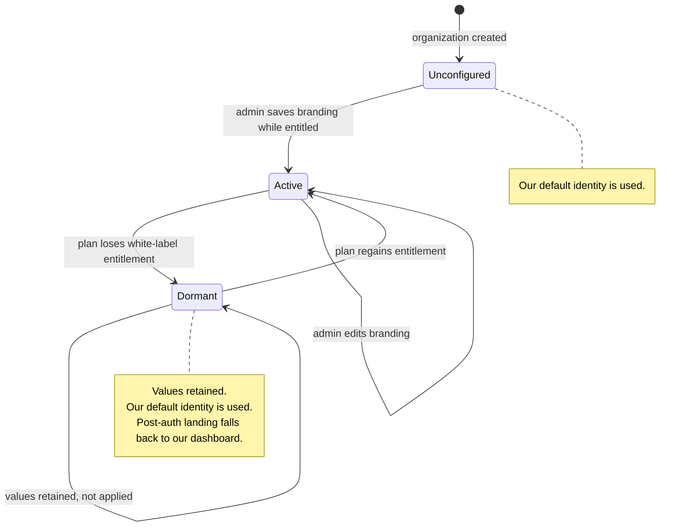
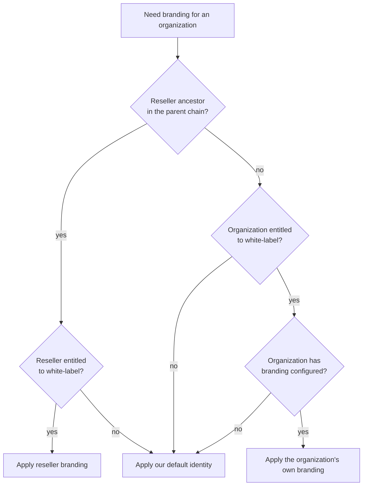
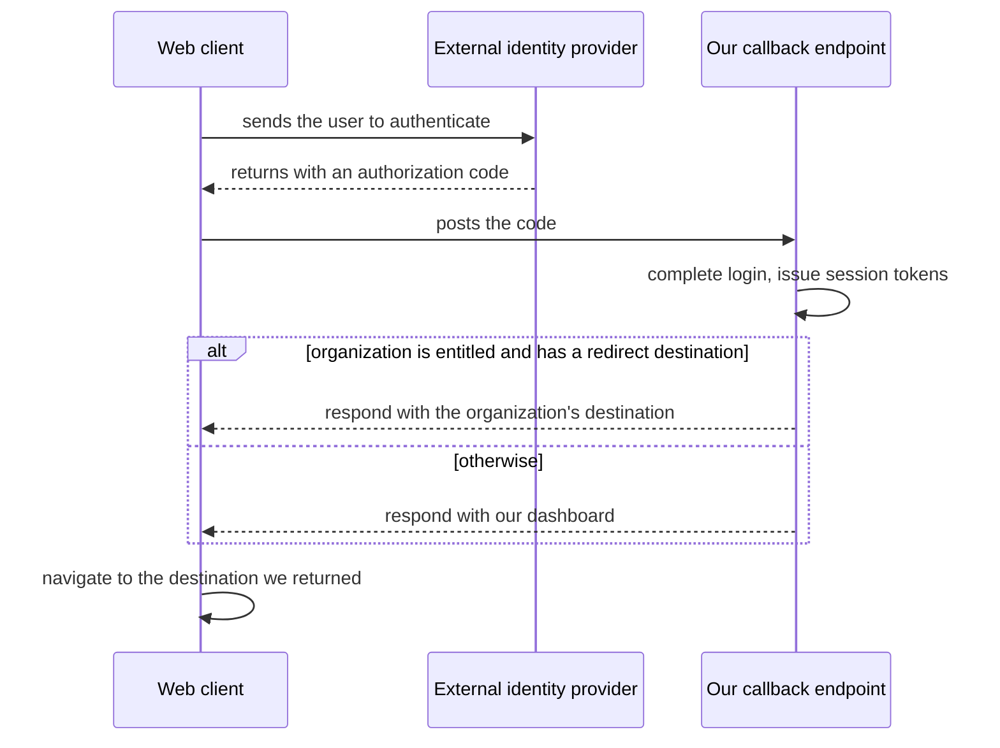

# Organization Auth-Area Branding for All Paying Customers — Spec

## 1. Business Context

Today an organization can put its own logo, colors, app name, and support address on the
pre-login experience, so people it invites never see a vendor name. That capability is
locked to *reseller* organizations — organizations flagged as able to invite and create
other organizations. Everyone else's invited users land on an accept page and receive an
invitation email that say Vinta Schedule.

The affected people are the ordinary members an organization invites: staff who were told
"you're getting a scheduling tool from us", then meet a product name they've never heard
of at the exact moment they're asked to create an account and hand over calendar access.
The admin who bought the product knows who we are. Nobody else in the organization needs
to, and today they all find out.

There is no customer currently blocked on this and no contractual date. It is a
positioning decision: the vendor should be visible to the buyer, not to the buyer's whole
staff. Doing nothing costs us nothing measurable that we can point at — the cost is that
every non-reseller customer's rollout carries an unexplained third-party name, which is
friction we chose to leave in place.

No reseller organizations exist in production yet. The reseller capability is built and
the branding path runs through it, but nobody is on it, so this change has no live tenants
to regress and no partners to notify. That is what makes now the cheap moment to do it.

The one stakeholder who should see this before it ships is whoever owns email
deliverability, since invitation emails gain a per-organization reply-to across a much
larger population of senders.

## 2. Hypothesis (to be validated)

Not a hypothesis — a known requirement driven by a product and positioning decision: only
the administrators who purchase and configure the product should need to know the vendor's
identity. No metric gate, no rollback-on-failed-validation. Success is defined by
correctness (see **Objectives**), not by a moved number.

## 3. Objectives (and how to validate Hypothesis)

Known requirement, so these are definition-of-done statements rather than validation
thresholds.

1. **An invited user of a branded organization sees no reference to the vendor anywhere on
   the path from invitation email to a signed-in session.**
   - Signal: a manual walkthrough plus an automated check of the invitation email body and
     the invitation accept page for the vendor name, vendor logo, and vendor-owned links.
   - Source: the rendered email and the accept page for a branded test organization.
   - Threshold: zero occurrences. The one accepted exception is the raw From address on the
     invitation email, which stays on our sending domain (see **Decisions → Use-cases**).
   - Timeframe: verified before release; kept honest by a regression test thereafter.

2. **An administrator of any paying top-level organization can configure branding without
   help, and nobody else can.**
   - Signal: an administrator with no special flag, no database access, and no support
     ticket sets a logo, colors, app name, support address, and redirect destination, then
     sees them applied on a real invitation. An administrator of an organization with a
     parent is offered no such surface, and a branding write sent directly to the backend
     on that organization's behalf is refused.
   - Source: the organization settings surface, and the backend's own authorization check.
   - Threshold: the first completes end-to-end with no involvement from us; the second is
     refused at the backend, not merely absent from the interface.
   - Timeframe: verified before release.

3. **The reseller branding path still works for the day we have resellers.**
   - Signal: branding resolution for a reseller and every organization beneath it produces
     the same app name, logo, and colors as before the change.
   - Source: the existing reseller branding test suite, extended to cover the new
     precedence rule. There are no reseller organizations in production, so this is a
     test-suite obligation, not a live-tenant one.
   - Threshold: no differences.
   - Timeframe: verified before release.

4. **The post-authentication redirect lands every organization's users where the
   organization configured, or on our dashboard when it configured nothing.**
   - Signal: authentication completes, tokens are issued on our own route, and the user is
     forwarded to the configured destination.
   - Source: end-to-end coverage of the authentication return path for a branded
     organization, an unbranded organization, and a reseller.
   - Threshold: no case lands anywhere other than the configured destination or the
     dashboard.
   - Timeframe: verified before release.

## 4. Decisions

### 4.1 Use-cases

**Use-case 1 — An administrator brands their organization**

- Actor: an owner or admin of a paying organization that has no parent. The organization
  does not need to be a reseller, but an organization that sits underneath another one
  cannot do this (see Use-case 5).
- Trigger: the administrator opens branding settings before inviting their staff.
- Flow:
  1. The administrator picks a public identifier for their organization. It must be unique,
     must not be one of our reserved names, must match the allowed format, and must not be
     a lookalike of an existing one. Branding cannot be saved until they have one.
  2. They open the branding settings for their organization.
  3. They upload a logo image, which goes straight from their browser to our storage
     without passing through our servers. PNG, JPEG, and WebP are accepted up to a size
     limit; anything else, including SVG, is rejected before the upload starts.
  4. They enter an app name, a primary and secondary color, a support email, and a redirect
     destination.
  5. The system accepts the values, rejecting any redirect destination that is not HTTPS
     or that contains a wildcard or path-prefix pattern.
  6. The branding takes effect immediately for that organization.
- Outcome: subsequent invitations from this organization carry its identity rather than
  ours.

**Use-case 2 — An invited user accepts an invitation from a branded organization**

- Actor: a person with no account, invited by a branded organization.
- Trigger: they receive the invitation email and click through.
- Flow:
  1. The invitation email arrives showing the organization's app name, logo, and colors,
     with replies routed to the organization's support address.
  2. They open the accept page, which renders the organization's app name, logo, and
     colors.
  3. They create their account and accept the invitation.
  4. Authentication completes, we issue their tokens and tell the client where to go, and
     they land on the organization's configured redirect destination.
- Outcome: the user joins the organization having seen only the organization's identity.

**Use-case 3 — A returning user of a branded organization signs in**

- Actor: an existing member of a branded organization.
- Trigger: they open the organization-scoped login URL they were given or bookmarked.
- Flow:
  1. The login URL carries the organization, so the page resolves and applies that
     organization's branding.
  2. They sign in.
  3. Authentication completes, we issue their tokens and tell the client where to go, and
     they land on the organization's redirect destination.
- Outcome: the returning-user path is branded too, not just first-time acceptance.

**Use-case 4 — An invited user of a reseller's child organization accepts**

- Actor: a person invited by an organization that sits underneath a reseller.
- Trigger: they open the invitation.
- Flow:
  1. Branding resolution walks upward and finds the reseller ancestor.
  2. The reseller's branding is applied.
  3. The rest proceeds as in Use-case 2.
- Outcome: the reseller's guarantee over its subtree is preserved unchanged.

**Use-case 5 — An administrator of a child organization looks for branding**

- Actor: an owner or admin of an organization that has a parent.
- Trigger: they go looking for branding settings, having seen them described somewhere or
  having managed a standalone organization before.
- Flow:
  1. The dashboard does not show a branding page for their organization.
  2. If they reach the underlying endpoint directly — by URL, by script, or by replaying a
     request captured from a standalone organization — the write is refused.
  3. Their organization continues to display whatever the reseller above them configured.
- Outcome: branding within a hierarchy is controlled at exactly one place, the reseller,
  and the restriction is enforced by the backend rather than only by a hidden menu item.

**Use-case 6 — A branded organization downgrades**

- Actor: the billing owner of a branded organization.
- Trigger: a plan change removes the white-label entitlement.
- Flow:
  1. The saved branding values are retained but stop being applied.
  2. Invitations and accept pages revert to our default identity.
  3. Post-authentication users land on our dashboard instead of the organization's
     redirect destination.
  4. On re-upgrade, the saved values apply again with no re-entry.
- Outcome: the downgrade degrades the experience without destroying configuration.

### 4.2 State transitions & edge cases

**Branding lifecycle**

**Branding resolution**

Only an organization with no parent can configure branding at all. Inside a hierarchy the
reseller is the single point of control: its child organizations have no branding page in
the dashboard, and the backend refuses a branding write from any organization that has a
parent, regardless of how the request arrives. Resolution therefore never has to choose
between a child's branding and its reseller's — the child cannot have any.

**Post-authentication redirect**

We decide the destination, not the caller. The client still supplies a callback address for
the provider's token exchange, because the protocol requires one, but that address no longer
determines where the user ends up — the destination comes from the organization's saved
configuration and is returned in our own response. This applies to every organization,
resellers included.

**Edge cases and their decided handling**

- **Login with no organization context.** A cold visit to the generic login page shows our
  default identity. Branding on the returning-user path is delivered through
  organization-scoped login URLs, not by guessing from the browser. Those URLs carry a new
  non-sequential public identifier rather than the organization's internal one, so the set
  of branded organizations and their names and logos cannot be harvested by walking numbers.
- **Free-plan organization.** No entitlement, so our default identity applies everywhere.
  Administrators of free organizations do not get a branding surface that silently does
  nothing.
- **Eligible organization with no public identifier yet.** The branding settings are still
  offered, and saving is refused with a message telling the administrator to pick an
  identifier first. Hiding the settings here would hide them from exactly the people who
  are one step from using them.
- **Administrator changes the public identifier.** Allowed. Branded login URLs already
  handed out stop resolving and fall back to our default identity, the same way an unknown
  identifier does. We keep no history and reserve nothing, so a released identifier can be
  claimed by another organization, whose branding those old URLs would then show.
- **Child organization attempts a branding write.** Refused by the backend with a clear
  reason, not silently ignored and not merely hidden in the interface. The refusal is based
  on the organization having a parent, so it holds no matter which entry point the request
  comes through.
- **A standalone organization later gains a parent.** Its saved branding stops being
  applied, because the reseller above it now wins resolution, and it can no longer edit
  those values. They are retained rather than deleted, so the organization is whole again
  if it is ever detached. Nothing about this is exercised today, since there are no
  hierarchies in production.
- **Redirect destination configured but unreachable at redirect time.** We forward as
  configured and do not probe it. A broken destination is the organization's to fix.
- **Redirect destination not configured.** Users land on our dashboard. This is the only
  point on the invited-user path where an unconfigured branded organization exposes our
  identity, and it is under the administrator's control.
- **More than one return destination.** The replacement stores a single destination. No
  organization currently has an allowlist with entries in it, so nothing is lost in the
  swap and the old storage is removed outright rather than kept dormant. Verify the
  emptiness against production immediately before the change lands, since it is what makes
  the removal free. If multiple destinations turn out to be needed later, that is a new
  capability rather than a restoration.
- **Invitation opened after the organization downgrades.** The email already sent keeps its
  branding; the accept page renders our default identity. The mismatch is accepted.
- **Logo that fails to load.** The page falls back to the app name as text rather than our
  logo, so a broken image never reintroduces our identity.
- **Logo requested for an organization that has none.** Every miss — an identifier nobody
  holds, an organization that never configured branding, one that configured branding
  without a logo, and one that has lost the entitlement — returns our default logo by the
  same path. The delivery address answers no questions about which organizations exist or
  which are branded.
- **Upload rejected.** Wrong file type, including SVG, or over the size limit: rejected
  before the upload starts, with a message naming the limit. Previously saved branding is
  untouched, so a failed logo change never costs the organization the logo it had.
- **Logo replaced.** The new image takes over at the same address. Copies already cached in
  a reader's browser or an already-delivered email may show the old one for a short while;
  the address is not versioned.
- **Idempotency.** Saving branding is an upsert against the organization: repeating the
  same save produces the same state and no side effects. Repeating the post-authentication
  redirect is a read of saved configuration and carries no state change.
- **Concurrency.** Two administrators saving at once resolve last-write-wins. Branding is
  low-stakes settings data edited rarely; no conflict is surfaced.
- **Time-bounded rules.** None. Branding does not expire, there is no soak window, and no
  scheduled re-evaluation. Entitlement changes take effect on the next resolution.

### 4.3 Acceptance scenarios

1. **Happy path — self-serve branding on a plain organization.**
   Given a paying organization that is not a reseller and has no parent,
   when its admin picks a public identifier, uploads a PNG logo, and saves an app name,
   colors, support address, and an HTTPS redirect destination,
   then the logo goes straight from the browser to our storage without passing through our
   servers, a subsequent invitation email and accept page render that organization's
   identity, and the accepted user is forwarded to that redirect destination after
   authenticating.

2. **Happy path — no vendor identity on the invited-user path.**
   Given the branded organization from the previous scenario,
   when an invited user goes from the invitation email through account creation to a
   signed-in session, and when they open that email again days later,
   then no page or email body contains our name, logo, or a link to us — the logo still
   renders on the later read — with the sole exception of the raw From address on the email.

3. **Error path — rejected input.**
   Given an admin editing branding,
   when they choose an SVG or an oversized image, or submit a redirect destination that is
   not HTTPS or that contains a wildcard or path-prefix pattern,
   then each is rejected with a message naming the rule that was broken, and the previously
   saved branding — including the existing logo — is left untouched.

4. **Edge — reseller ancestor wins.**
   Given a child organization under a branded reseller,
   when a user is invited by the child organization,
   then the reseller's app name, logo, and colors are applied.

5. **Error path — a child organization cannot brand itself.**
   Given an organization that has a parent,
   when its admin opens the dashboard, then no branding page is offered;
   and when a branding write for that organization is sent directly to the backend,
   then it is refused with a reason, and nothing about the organization's rendered
   branding changes.

6. **Edge — not entitled.**
   Given an organization on the free plan, and separately one that configured branding and
   then lost the entitlement,
   when a user is invited and accepts,
   then our default identity is applied in both cases — including the default logo — the
   downgraded organization's saved values remain intact, and its users land on our dashboard
   rather than its configured redirect destination.

7. **Edge — reseller redirect under the unified route.**
   Given a reseller organization with a configured redirect destination,
   when one of its users authenticates,
   then they receive tokens and are sent to the reseller's configured destination. Exercised
   against a test fixture, since no reseller organizations exist in production.

### 4.4 Negative scope

- **No custom domains.** Authentication pages stay on our domain. No per-organization
  vanity hostnames, no certificate management. A user who reads the address bar can still
  see us.
- **No branding of the signed-in application.** Once past authentication, the product looks
  like ours. This spec covers the pre-login and invitation path only.
- **No rebranding of the external calendar consent screen.** The provider's own consent
  screen shows the name registered on our developer account. Changing that would require
  every customer to register and verify their own credentials with the provider, which is
  a separate and much larger piece of work.
- **No branding for organizations inside a hierarchy.** An organization with a parent gets
  no branding page and no way to write branding through any entry point. Branding within a
  hierarchy belongs to the reseller alone. There is no per-child override and no
  reseller-granted opt-out for children.
- **No hiding-only enforcement.** Removing the page from the dashboard is not the control.
  The backend refusal is, and the hidden page is a convenience on top of it.
- **No change to how reseller branding resolves.** The parent-chain walk, the reseller's
  authority over its subtree, and the fallback to our default identity all stay as they
  are. The one deliberate exception is the redirect mechanics, which unify for everyone —
  called out here rather than hidden.
- **No image processing.** The uploaded logo is stored and served as given — no resizing,
  cropping, format conversion, or thumbnails.
- **No content review of uploaded logos.** See **Open questions**.
- **No pointing at a logo hosted elsewhere.** The upload replaces the old
  supply-us-a-URL field rather than sitting beside it, so we never render an address the
  organization can repoint after we have accepted it.
- **No custom From address.** Only reply-to is per-organization. Sending-domain
  verification is not in this scope.
- **No branding on the generic login page.** Without organization context we show our
  default identity, and we do not infer the organization from the browser.
- **No adoption target.** We are not measuring uptake or treating low uptake as a signal to
  reverse.

## 5. Alternatives considered

**Grant the reseller flag to every organization.** This would have made branding available
immediately with no new resolution logic, but the flag also enables creating and inviting
other organizations — a whole capability bundle with billing, permission, and hierarchy
consequences. Rejected: it couples a cosmetic capability to a structural one.

**Keep branding reseller-only and give administrators a "hide vendor name" toggle.**
Cheaper, and it addresses the stated concern directly. Rejected: it produces an unbranded
page rather than a branded one, which reads as broken rather than as the organization's,
and it leaves the invitation email with nothing to show.

**Make branding free for all plans.** Matches "available to all customers" most literally.
Rejected: it removes an existing paid differentiator, and free-tier organizations are the
population most likely to abuse a branded invitation email.

**Keep the existing destination allowlist and validate a caller-supplied return target.**
Preserves the current public contract and gives organizations more than one destination.
Rejected in favor of a single configured destination resolved on our own route, which
removes the caller-supplied redirect target entirely and with it the open-redirect surface
that widening the allowlist to every paying organization would have created.

## 6. Open questions

1. **What belongs on the reserved-identifier list, and who maintains it?** Administrators
   pick their own identifier, so the list is what stands between us and someone claiming a
   name we need or a name that implies someone else. Recommended default: seed it with our
   own route names and names implying us, then review when the first rejection complaint
   arrives. Answerable by product. Blocks nothing.
2. **Does a per-organization reply-to address need any verification?** Nothing stops an
   admin from entering an address they do not control. Recommended default: no
   verification in this scope, revisit if abuse appears. Answerable by whoever owns email
   deliverability. Unblocks the email change.
3. **Do uploaded logos need any storage lifecycle?** A replaced logo leaves its predecessor
   in storage forever, and an organization that churns keeps whatever it uploaded.
   Recommended default: leave them, revisit if storage cost or a deletion request makes it
   matter. Answerable by whoever owns infrastructure. Blocks nothing.
4. **Is there any review of what organizations put in the app name and logo?** A branded
   invitation email from an organization impersonating a well-known brand is a credible
   phishing vector once this is open to every paying customer. Recommended default: no
   pre-publication review, with a takedown path on report. Answerable by whoever owns trust
   and safety. Unblocks nothing, but should be decided before release.

## 7. Risks assumed

- **Removing the public return-URL validation query breaks an integration we forgot about.**
  Assumption: we have no resellers and no partners on the public API, so the query has no
  callers. Mitigation: confirm there are none before removing, which is a lookup rather
  than a negotiation. Likelihood low, severity low while that assumption holds — and it is
  the reason to remove the query now rather than after the first reseller signs.
- **The unified redirect path is wrong in a way tests do not catch.** Assumption: the
  internal return route is a faithful superset of the reseller return behavior it replaces.
  Mitigation: end-to-end coverage of the return path for a branded organization, an
  unbranded one, and a reseller fixture. With no reseller tenants live, a defect here is
  caught in test or costs a revert, not a customer incident. Likelihood low, severity
  medium.
- **Branded invitation emails become a phishing vector.** Assumption: paying customers with
  a billing relationship will not impersonate other brands at scale. Mitigation: partial —
  public identifiers reject reserved names and lookalikes of existing ones, which blocks the
  cheapest version of the attack, but nothing reviews app names or logos — and uploading a
  logo is now easier than hosting one. Accepted pending the trust and safety decision in
  **Open questions**. Likelihood low, severity high.
- **The logo upload becomes a way to put files on our storage.** Assumption: restricting who
  can request an upload to administrators of branding-eligible organizations, capping size,
  and allowing only three image types keeps this uninteresting to abuse. Mitigation: those
  three constraints, plus the fact that an uploaded object is unreachable until a branding
  record points at it. Likelihood low, severity medium.
- **Serving logos ourselves puts an anonymous read path in front of our storage.**
  Assumption: logo traffic stays small enough that serving it without a content delivery
  network is fine. Mitigation: caching headers, and the address resolves only through a
  branding record so it cannot be aimed at arbitrary stored files. Likelihood medium,
  severity low.
- **A released public identifier is claimed by another organization.** Assumption:
  identifiers change rarely, and a stale branded login URL showing the new owner's branding
  is acceptable rather than misleading. Mitigation: none — no history, no reservation.
  Likelihood low, severity medium.
- **Per-organization reply-to addresses hurt deliverability or confuse recipients.**
  Assumption: keeping the From address on our own sending domain preserves authentication
  and reputation. Mitigation: reply-to only, no custom From. Likelihood low, severity
  medium.
- **The unauthenticated branding lookup gets hot enough to matter.** Assumption: opening
  branding to every paying organization does not meaningfully change the load on the public
  branding query, which already resolves entitlements without a session. Mitigation: none
  planned; the existing caching is assumed sufficient. Likelihood low, severity medium.
- **A child organization wants its own branding and has no path to it.** Assumption:
  organizations inside a hierarchy accept the reseller's identity as the point of the
  arrangement, so this does not become a support burden or a blocker on a reseller deal.
  Mitigation: none — accepted. Loosening this later is additive; tightening it later would
  not be, which is why it starts closed. Likelihood low, severity low.
- **Reversibility.** The branding scope change and the entitlement widening are reversible
  by configuration. The removal of the public return-URL validation query is a one-way door
  in principle, but with no callers it costs nothing to walk back through. The redirect
  unification is reversible only by revert. Replacing the allowlist with a single
  destination removes the old storage in the same step rather than keeping it dormant: a
  revert restores the shape but not the contents, which is acceptable only because the
  contents are empty. That emptiness is the assumption to check before the change lands, not
  after.
