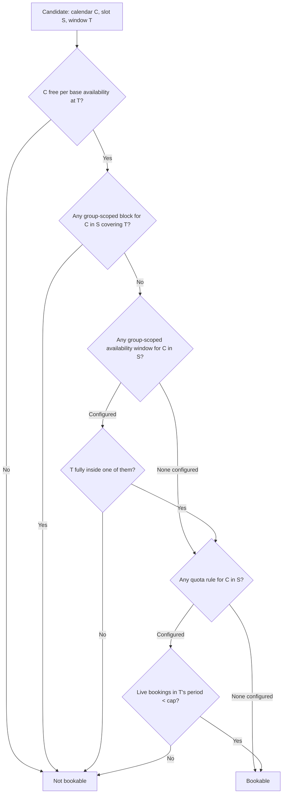

# Calendar Group-Scoped Availability — Spec

## 1. Business Context

A calendar group aggregates calendars into named slots so one booking can pick a calendar from each slot and guarantee everyone picked is free at the same time. Availability today lives in exactly one place: on the calendar itself. A calendar is either available at a time or it is not, and every group that calendar belongs to sees the same answer.

Real rosters do not work that way. A surgeon is on shift Monday to Friday, 9am to 5pm — that is their calendar availability, and it is correct for consults, rounds, and admin. But they only operate on Tuesdays and Thursdays, they take at most three operations a week, and next week they are at a conference and will take no operations at all while still seeing patients. None of that can be expressed today.

What organizations do instead is split one person into several resource calendars — a "Dr. X surgery" calendar and a "Dr. X consults" calendar — each with its own availability, each placed in a different group. This has three costs:

- **It double-books the human.** The two calendars do not know about each other, so the surgery group can book Dr. X at 10am on a Tuesday while the consult group books the same person at the same time. The system's core promise — that everyone selected is simultaneously free — is silently false for anyone who has been split.
- **It inflates the resource calendar plan limit.** An organization pays for calendars proportional to the number of activities per person, not the number of people.
- **It multiplies configuration.** Every schedule change has to be replicated across each of a person's calendars, by hand, correctly.

The alternative workaround — blocking out the unwanted days — is worse: a block on Monday hides the surgeon from every group, including the consult group where they genuinely are available.

Stakeholders: organization admins and schedulers who will configure rosters, the org members whose time is being scheduled, and the integration partners who will push roster data in from upstream systems.

**There are no customers on the product yet.** That shapes this spec in two ways. The cost of doing nothing is entirely prospective, not incurred: no support tickets, no double-booking incidents, no churn — the cost is that organizations with role-specific staff cannot model their roster, which makes calendar groups unusable for a large share of the intended market. And because there is no installed base, decisions that would ordinarily be breaking changes are free right now. Where this spec makes a rule consistent at the cost of changing existing behavior, it does so deliberately, on the reasoning that the change gets more expensive with every customer added.

## 2. Hypothesis (to be validated)

Not a hypothesis — **known requirement**. The driver is that calendar groups cannot model role-specific staff, which is the majority of the clinical, legal, and professional-services scheduling this product targets. There is no validation gate and no kill criterion; correctness and scope discipline are what matter. There is no hard deadline.

## 3. Objectives (and definition of done)

1. **A calendar can be narrowed inside one group without affecting any other group.**
   - Signal: a calendar configured with group-scoped availability in one group is offered only in the narrowed windows there, and remains offered on its full base availability in every other group and in single-calendar booking.
   - Source: acceptance scenarios, exercised end to end.
   - Threshold: binary — it holds or it does not.

2. **Existing groups behave exactly as they do today.**
   - Signal: for any group where no group-scoped availability, blocked time, or quota rule is configured, slot discovery and group availability checks return output identical to the current behavior, with no additional queries issued.
   - Source: comparison against pre-change behavior across the existing group test suite.
   - Threshold: byte-for-byte identical output; zero extra queries on the unconfigured path.
   - This mirrors the identical-output guarantee the booking-policy work already holds itself to.

3. **Every enforcement surface agrees.**
   - Signal: a calendar that is outside its group-scoped window, inside a group-scoped block, or over its quota is simultaneously (a) absent from slot discovery, (b) rejected when named explicitly at booking time, and (c) reported consistently by the public and internal read surfaces.
   - Source: acceptance scenarios covering each surface for the same configuration.
   - Threshold: no surface disagrees with any other.

4. **Configuration changes are attributable.**
   - Signal: creating, editing, or deleting a window, block, or quota rule produces an audit record naming the actor, with before/after values on updates.
   - Source: audit trail.
   - Threshold: all three concepts, all three operations.

Definition of done: objectives 1 through 4 all hold, verified by the acceptance scenarios below.

## 4. Decisions

Three group-scoped concepts are introduced. All three attach to a **(calendar, group slot)** pair — the calendar as it participates in one specific role of one specific group. A calendar may belong to at most one slot per group, so this is equivalent to per-(calendar, group) granularity today, while leaving room for a calendar to sit in differently-configured slots later.

| Concept | What it does | Interaction with base availability | Counts against the availability window plan limit |
| --- | --- | --- | --- |
| Group-scoped availability window | Positive time windows, full recurrence | **Intersects** — narrows only, never widens | Yes |
| Group-scoped blocked time | Removes time within that group only | Always wins over windows and base availability | Yes — a block is a window in every practical sense |
| Group-scoped quota rule | Caps booked events per fixed period | Independent of time; caps volume | No — not a time window, and few per organization |

Metering blocked time only when it is group-scoped would leave two identical-looking rows metered differently. To keep one rule — *every time window an organization authors is metered, positive or negative* — **all blocked time becomes metered, base rows included**.

This is a change to existing billing behavior rather than an additive one, and it is made now precisely because there are no customers. With an installed base it would mean usage jumping on deploy and organizations landing over their limit without having done anything; with none, it costs nothing and the rule is consistent from the first customer onward. Deferring it would mean either living with the asymmetry permanently or paying for the migration later.

Availability windows and blocked time use the same recurrence expressiveness as existing availability: recurrence rules, per-occurrence exceptions, bulk modifications, and a per-window timezone chosen by the author.

**Fall-through is the default.** A calendar in a group slot with none of the three configured behaves exactly as it does today: its base availability applies unchanged. Configuring group-scoped behavior is opt-in, per calendar, per slot.

### 4.1 Use-cases

**UC-1 — Admin narrows a surgeon to operating days**
- Actor: organization admin.
- Trigger: setting up the Surgery group's roster.
- Flow:
  1. Admin opens Dr. Reyes' entry in the Surgery group's "Lead Surgeon" slot.
  2. Admin adds a weekly recurring availability window: Tuesdays and Thursdays, 9am to 5pm, in the clinic's timezone.
  3. Admin saves.
- Outcome: the Surgery group offers Dr. Reyes only on Tuesdays and Thursdays. The Consults group, where Dr. Reyes also sits, still offers them Monday to Friday. Dr. Reyes' base availability is untouched.

**UC-2 — Member caps their own weekly load**
- Actor: Dr. Reyes, who owns their calendar.
- Trigger: they are being over-booked for operations.
- Flow:
  1. Dr. Reyes opens their own entry in the Surgery group.
  2. They add a quota rule: at most 3 bookings per week.
  3. They save.
- Outcome: once three operations are booked in a given week, Dr. Reyes stops being offered for that week in the Surgery group and any direct booking attempt naming them for that week is rejected. The following week resets. They remain fully offered in the Consults group.

**UC-3 — Member blocks one week for one activity**
- Actor: Dr. Reyes.
- Trigger: a conference next Tuesday and Thursday, during which they will still take remote consults.
- Flow:
  1. Dr. Reyes adds a group-scoped block covering next Tuesday and Thursday in the Surgery group.
  2. They save.
- Outcome: the Surgery group offers nothing for Dr. Reyes on those two days. The Consults group is unaffected — no base availability was changed and no global block was created.

**UC-4 — Patient books through the group**
- Actor: an external person booking through a public scheduling link.
- Trigger: they request a surgery appointment.
- Flow:
  1. They ask for available slots in the Surgery group over the next month.
  2. The group returns only windows where every slot has enough calendars satisfying all of: base availability, group-scoped windows, no group-scoped block, and quota not yet consumed for that period.
  3. They pick a slot and confirm.
- Outcome: the booking succeeds and no one is offered a time they would have declined.

**UC-5 — Upstream rostering system pushes windows**
- Actor: an integration partner's rostering system, with no human present.
- Trigger: the monthly roster is published upstream.
- Flow:
  1. The system authenticates against the public API and submits a batch of group-scoped windows for many calendars across several groups.
  2. The batch is applied as a bulk upsert.
  3. The system replays the same batch after a network timeout.
- Outcome: the first call applies the roster; the replay is a no-op. If the batch would push the organization past its availability window plan limit, the whole batch is rejected with the same over-limit response shape the existing availability batch write already returns.

**UC-6 — Admin tightens a window that orphans bookings**
- Actor: organization admin.
- Trigger: Dr. Reyes drops Tuesdays.
- Flow:
  1. Admin edits the window from Tuesdays and Thursdays down to Thursdays only.
  2. Admin saves.
- Outcome: the change is applied, and the response lists every confirmed future booking for Dr. Reyes in the Surgery group that now falls outside the window. The admin decides individually whether to cancel or reschedule each one. Nothing is cancelled automatically.

### 4.2 State transitions & edge cases

There is no lifecycle state machine — windows, blocks, and quota rules exist or they do not. What matters is the **resolution order** that decides whether a calendar is bookable in a slot at a given time.

Two properties follow from this order and are load-bearing:

- **Narrowing only.** A group-scoped window can never make a calendar bookable at a time its base availability excludes. Base availability stays the single source of truth for when a person or resource works at all.
- **Blocks beat everything.** A group-scoped block removes time regardless of what any window says, and only within its own group.

**Edge cases and their decided handling:**

| Edge case | Handling |
| --- | --- |
| Nothing configured for a calendar in a slot | Base availability applies unchanged. No extra work is done on this path. |
| Group-scoped window extends beyond base availability | The excess is ignored. If a window falls entirely outside base availability, the calendar is simply never offered — the save is accepted, not rejected. |
| Narrowing orphans confirmed future bookings | Save succeeds. The response lists the affected future bookings. No automatic cancellation, no notification to attendees. |
| Calendar removed from a slot, or the slot or group is deleted | Its group-scoped windows, blocks, and quota rules are deleted with it. Re-adding the calendar starts from an empty configuration. |
| Quota consumed for the period | The calendar is both hidden from discovery for that period and rejected if named explicitly at booking time. No admin escape hatch in v1. |
| Booking cancelled | Quota is counted from live bookings and recomputed on read, so the freed capacity is immediately available again. |
| Booking rescheduled across a period boundary | The count moves with it — it leaves the old period and joins the new one. Recomputation makes this automatic. |
| Slot requires more than one calendar | Each candidate calendar is evaluated independently; the slot is satisfied when enough candidates pass the full chain. |
| Calendar in several groups | Each group's configuration is independent. A block in one group has no effect in any other. |
| Daylight saving transitions | Windows carry their own timezone, as existing availability does, so a "9am to 5pm Tuesday" window stays 9am to 5pm local across a DST shift. |
| Bundle calendar sits in a group slot | A group-scoped window, block, or quota rule attaches to the bundle calendar itself. Its children are evaluated on base availability alone and carry no group-scoped configuration of their own. |
| Batch write exceeds the availability window plan limit | The whole batch is rejected, matching how the existing availability batch write behaves — no partial application. Windows and blocks both consume the limit; quota rules do not. |

**Idempotency.** Writes are bulk upserts. Replaying an identical batch is a no-op and leaves the same final state. This is deliberately identical to the existing availability batch write so integrations do not need to learn a second contract.

**Concurrency.** Last-write-wins. Two admins editing the same window concurrently means the later save stands; no conflict is surfaced. This matches existing availability writes.

**Time-bounded rules.** Quota periods are fixed calendar periods — day, week, or month — chosen per rule and aligned to calendar boundaries in the relevant timezone. No rolling windows, no TTLs, no scheduled re-evaluation: quota is derived on read, never stored.

Week boundaries need an organization week-start setting, and none exists today — the only week start in the system is per recurrence rule, defaulting to Monday. A new organization-level setting is introduced: editable by admins, defaulting to Monday, and used for nothing except quota period boundaries. It does not affect recurrence rules, existing week handling, or any display.

**Permissions.** A calendar's owner may edit that calendar's group-scoped configuration, and only within groups they can see — so a member cannot learn about groups they are not part of through error messages or listings. Organization admins may edit anyone's. Resource calendars with no owner are admin-only by construction.

**Audit.** Creating, editing, and deleting windows, blocks, and quota rules is written to the audit trail, with before/after values on updates. "Who made the surgeon unbookable on Tuesdays" is precisely the question this exists to answer.

**Surfaces.** All three concepts — windows, blocks, and quota rules — are honored on all four surfaces, with no concept exposed on fewer than another:

1. Group slot discovery and group availability checks filter on all three.
2. Booking and rescheduling reject a calendar that violates any of the three, including when the caller names the calendar explicitly rather than picking a discovered slot.
3. The public API can read and batch-write all three, under the same permission and organization-scoping rules the existing availability surface uses.
4. The internal management surface can list, create, edit, and delete all three.

### 4.3 Acceptance scenarios

1. **Happy path — narrowing works, and is scoped.**
   Given Dr. Reyes is available Monday to Friday 9am–5pm and belongs to both the Surgery group and the Consults group, when an admin adds a Tuesday-and-Thursday 9am–5pm window for Dr. Reyes in the Surgery group, then Surgery slot discovery offers Dr. Reyes only on Tuesdays and Thursdays, and Consults slot discovery still offers them Monday to Friday.

2. **Zero change for unconfigured groups.**
   Given a group where no calendar has any group-scoped window, block, or quota rule, when slot discovery runs over any search window, then the result is identical to the pre-change result and no additional queries are issued.

3. **Narrowing cannot widen.**
   Given Dr. Reyes' base availability is Monday to Friday, when an admin adds a Saturday 9am–1pm group-scoped window in the Surgery group, then the window is saved but Saturday is never offered, because base availability excludes it.

4. **Error path — explicit booking outside the window is rejected.**
   Given Dr. Reyes has a Tuesday-and-Thursday window in the Surgery group, when a caller attempts to book Dr. Reyes into that group for a Wednesday at 10am by naming the calendar directly rather than picking a discovered slot, then the booking is rejected with an error identifying the calendar and the reason.

5. **Edge case — quota consumed and then released.**
   Given Dr. Reyes has a quota of 3 bookings per week in the Surgery group and 3 are booked for the week of the 10th, when slot discovery runs for that week, then Dr. Reyes is not offered; and when one of the three bookings is cancelled, then Dr. Reyes is offered again for that week without any further action.

6. **Edge case — narrowing orphans a booking.**
   Given Dr. Reyes has confirmed Surgery bookings on upcoming Tuesdays, when an admin narrows the window to Thursdays only, then the save succeeds, the response lists those Tuesday bookings, and none of them is cancelled or modified.

7. **Integration-driven — idempotent batch write under the plan limit.**
   Given an integration submits a batch of group-scoped windows through the public API, when the identical batch is submitted a second time after a timeout, then the final state matches the single-submission state; and given a batch that would push the organization past its availability window plan limit, when it is submitted, then the entire batch is rejected with the existing over-limit response and nothing is created.

### 4.4 Negative scope

- **Availability per event type or service.** Narrowing by what is being booked — a 30-minute consult versus a 3-hour operation — is a different axis from which group. Deferred; no v2 commitment.
- **Bulk copy across groups or calendars.** "Apply this Tuesday/Thursday pattern to all six surgeons" and "copy the Surgery group's config to the Endoscopy group" are convenience tooling on top of the core model. Deferred until the core model is proven in use.
- **Group throughput caps.** Quota in v1 is per calendar. "The Surgery group does at most 10 operations a week" across everyone is a different rule with different resolution and is not included.
- **Rolling quota windows.** "At most 3 in any rolling 7 days" is excluded — fixed calendar periods only.
- **Admin override of quota at booking time.** No escape hatch for urgent cases in v1; over quota means rejected, for everyone.
- **Automatic handling of orphaned bookings.** No auto-cancel, no auto-reschedule, no notification to affected attendees. The warning is returned to the caller and the decision is theirs.
- **Widening.** No mechanism, flag, or admin power makes a calendar bookable in a group at a time its base availability excludes.
- **Conflict detection on concurrent edits.** Last-write-wins is accepted; no optimistic locking is added here.
- **Changes to single-calendar booking.** Booking a calendar directly, outside any group, is untouched. Its availability, its policy resolution, and its outputs must not shift.
- **Changes to the existing availability contract.** The existing calendar availability read and batch-write surfaces keep their current shapes and semantics byte-for-byte; group-scoped configuration is additive.
- **Changes to booking policy resolution.** Lead time, max horizon, and buffers resolve exactly as they do today. Group-scoped availability is a separate filter, not a new level in that chain.

## 5. Alternatives considered

**Keep splitting people into multiple resource calendars.** This is the status quo. Rejected because it defeats the product's core guarantee — two calendars representing the same human do not know about each other, so the system will confidently double-book a person it has promised is free. It also charges organizations per activity rather than per person.

**Express the restriction as blocked time on the calendar.** Rejected because blocks are global. Blocking Monday to hide a surgeon from the Surgery group also hides them from the Consults group where they genuinely are available, which is the exact problem being solved.

**Attach the window to the group as a whole rather than per calendar.** A group-level operating window ("Surgery runs Tuesdays and Thursdays") is simpler, but cannot express two surgeons with different operating days in the same group — which is the normal case, not the exception.

**Let the group-scoped window override base availability instead of intersecting it.** Rejected because it lets a group make someone bookable at a time their own calendar says they are not working, and it removes any single answer to "when does this person work". Intersection keeps base availability authoritative and makes the group configuration purely subtractive, which is also what makes the fall-through default safe.

**Attach at (calendar, group) instead of (calendar, group slot).** Equivalent today, since a calendar belongs to at most one slot per group. Slot granularity was chosen because it costs nothing now and leaves room for a calendar to occupy differently-configured roles later without a migration.

## 6. Open questions

All questions raised while drafting were resolved on 2026-08-05 and now live in **Decisions**: plan-limit treatment of each concept, the organization week-start setting, bundle calendar behavior, and public API exposure of all three concepts. A follow-up question about whether plan limits need raising, given blocked time now consumes the counter, was also resolved: limits stay as they are and metering switches on immediately, which costs nothing while the product is pre-customer.

Nothing is outstanding. Two things are deliberately deferred rather than unknown, and are recorded where they belong:

- Whether slot discovery should explain *why* a calendar is absent, rather than silently omitting it. Accepted as-is for v1; see **Risks assumed**.
- Retuning plan limits once real usage exists. Nothing to measure while pre-customer; see **Risks assumed**.

## 7. Risks assumed

- **Quota recomputation degrades discovery performance.** Quota is derived on read, so a search window with many candidate times against many calendars means repeated counting. *Assumption:* participant counts per group and booking volumes per period are small enough that counting stays cheap. *Mitigation:* count only for slots that actually have a quota rule, and skip the path entirely when none is configured — which also protects the zero-change guarantee. *Likelihood medium, severity medium.*

- **~~Reusing the recurrence machinery inherits its known defect.~~** *Resolved 2026-08-05.* The bulk-modification defect that duplicated open-ended recurring series has been fixed, so group-scoped windows and blocks reuse the recurrence machinery without inheriting it. No longer a prerequisite.

- **Metering all blocked time would be a breaking change with an installed base.** Blocked time is not metered today, so counting it raises reported usage for anyone who has authored any. *Assumption:* there are no live customer organizations at the time this ships. *Mitigation:* ship it before there are — the change is free now and expensive later. If the customer situation changes before this lands, revisit: the measure-first-then-raise-limits path was considered and declined only because there is nothing to measure. *Likelihood low while pre-customer, severity low — but severity rises to medium the moment the first organization onboards.*

- **Quota silently removing someone reads as a bug.** A scheduler who does not know a quota rule exists sees a surgeon vanish from next week's availability with no explanation. *Assumption:* the reason is surfaced somewhere the scheduler will look. *Mitigation:* the booking-time rejection names the quota as the reason; whether discovery also explains absences is undecided — accepted for v1. *Likelihood high, severity low.*

- **Intersect-only confuses admins.** Someone configures a Saturday surgery window, saves successfully, and Saturday never appears — because base availability excludes it. The save gave no hint. *Assumption:* admins will connect the two. *Mitigation:* none in v1 beyond documentation; a validation warning at save time is a candidate improvement. *Likelihood medium, severity low.*

- **Plan limits may be set at the wrong level for real usage.** Group-scoped windows *and* blocks share the existing counter, and an ad-hoc "no surgery next week" block is a routine, repeated member action rather than one-time setup. Plan values were chosen before any of this existed. *Assumption:* current limits are roughly right. *Mitigation:* none needed yet — with no customers, limits can be retuned freely once real usage appears. The existing limit-warning notification path gives the signal to retune. *Likelihood medium that limits need adjusting, severity low while pre-customer.*

- **The zero-change guarantee is hard to prove rather than assert.** Adding filters to a hot read path risks subtly altering results for groups that configured nothing. *Assumption:* the unconfigured path can be short-circuited before any new work is done. *Mitigation:* make it an explicit acceptance scenario asserting both identical output and no extra queries, as the booking-policy work did. *Likelihood low, severity high.*

- **Cascade deletion loses configuration silently.** Removing a calendar from a slot — a routine roster edit — destroys a carefully-built recurring schedule with no recovery path. *Assumption:* roster membership is stable enough that this is rare. *Mitigation:* accepted, no mitigation; the audit trail records what was deleted, which allows manual reconstruction. *Likelihood low, severity medium.*

- **Three concepts is a large v1.** Windows alone solve the stated surgeon example; blocks and quota expand the surface considerably, and quota in particular is a counting mechanism unrelated to time windows. *Assumption:* all three are genuinely required together. *Mitigation:* accepted after explicit confirmation; the phased plan should sequence windows first so partial delivery is still useful. *Likelihood medium, severity medium.*
