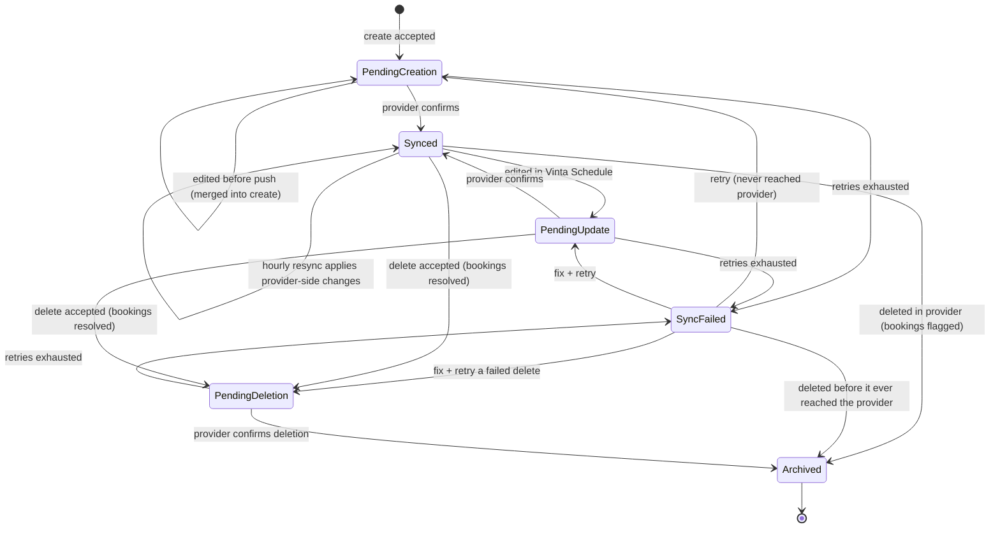

# Resource Calendar Provider Sync — Spec

## 1. Business Context

An integration partner needs to manage an organization's meeting rooms (create, rename, resize, relocate, remove) through Vinta Schedule's API. Today it cannot do that without someone opening the Google Workspace or Microsoft 365 admin console. Tenant admins using the web app, and Vinta's own operations staff, need the same ability.

Today, rooms on Google or Microsoft reach Vinta Schedule only one way. A Workspace or Microsoft 365 administrator creates the room in the provider's admin console. Then someone starts a resource import in Vinta Schedule. After import, the room is **read-only** in Vinta Schedule: editing it is rejected. Separately, Vinta Schedule can create "manual" rooms, but they exist only in Vinta Schedule and never appear in Google Calendar or Outlook.

The cost of doing nothing (no figures were provided; these are qualitative):

- **Admin-console dependency.** Every room change needs a provider super-admin, which slows customer onboarding and blocks the partner's self-service flow.
- **Stale data and drift.** Renames, capacity changes and removals made in the provider reach Vinta Schedule only when someone runs an import again, and sometimes never.
- **Support tickets.** Room add, rename and remove requests end up with support or ops staff, who handle them by hand.

Stakeholders to keep informed:

- **Integration partner** — the driver of this work and the consumer of the public API contract.
- **Frontend (web app) team** — builds the tenant-admin screens for create, edit and delete.

External dependency without sign-off rights: each customer's **Google Workspace / Microsoft 365 IT administrator** must grant Vinta Schedule broader directory permissions before any write can reach their provider (see **Risks assumed**).

## 2. Hypothesis (to be validated)

Not a hypothesis — known requirement. The driver is a partner integration that has to manage an organization's rooms through Vinta Schedule's API and keep them in step with Google Calendar and Outlook Calendar. No hard deadline: the partner is waiting, but not on a contractual date.

## 3. Objectives (and how to validate Hypothesis)

Known requirement, so this section gives the **definition of done**.

1. **The partner completes the full room lifecycle end to end in staging, on both providers, with no admin-console steps.**
   - **Signal:** the partner, working against staging with one real Google Workspace tenant and one real Microsoft 365 tenant, does each of the following through the public API only:
     - creates a room and sees it bookable in Vinta Schedule and present in the provider;
     - edits name, description, capacity and location, and sees the change in the provider;
     - renames a room in the provider and sees the rename in Vinta Schedule within one resync cycle;
     - deletes a room with future bookings, using each resolution (cancel the deletion, move bookings, cancel bookings);
     - deletes a room in the provider and sees it archived in Vinta Schedule, with its bookings flagged.
   - **Data source:** a joint staging test session with the partner, checked against each provider's admin console.
   - **Threshold:** every step above succeeds on both providers. Every scenario in **Decisions → Acceptance scenarios** passes.
   - **Timeframe:** before the feature is turned on for any production organization.

## 4. Decisions

Terminology used below:

- **Room** — a resource calendar for a bookable meeting room.
- **Synced room** — a room linked to a room in Google Workspace or Microsoft 365.
- **Manual room** — a room that exists only in Vinta Schedule (today's behavior, unchanged).
- **Write-enabled organization** — an organization that has connected an organization-level admin credential with write permission for a provider (see use-case 0).
- **Booking** — a calendar event, or a recurring series, that includes the room.

### 4.1 Use-cases

**0. IT admin enables write access for a provider (prerequisite)**
- **Actor:** the customer's Google Workspace or Microsoft 365 IT administrator, with a tenant admin or Vinta ops.
- **Trigger:** the organization wants Vinta Schedule to manage its rooms.
- **Flow:**
  1. For Google: the IT admin re-grants the existing service-account delegation with the room-directory **write** permission, replacing today's read-only one.
  2. For Microsoft: the IT admin grants Vinta Schedule an organization-wide (app-only) connection with room-management permission and the matching Exchange roles.
  3. Vinta Schedule verifies the credential can write before it marks the organization write-enabled for that provider.
- **Outcome:** the organization is write-enabled for that provider. Without this, synced rooms stay read-only, as they are today.

**1. Partner creates a synced room**
- **Actor:** integration partner, through the public API with an organization-wide token. The same flow is available to a tenant admin in the web app and to Vinta ops.
- **Trigger:** the partner's system needs a new room, for example "Conf Room 4B".
- **Flow:**
  1. The partner lists the provider's existing buildings and floors for the organization. This list is read-only; Vinta Schedule does not create buildings or floors.
  2. The partner sends a create request with the target provider (Google or Microsoft), name, description, capacity, a building/floor reference from step 1, and an optional idempotency key.
  3. Vinta Schedule validates the request: the provider is write-enabled, the location exists, and the organization is under its room plan limit. On success it accepts the request right away. The room is created with status **pending creation** and counts against the plan limit from this moment. It is visible but **not bookable**.
  4. In the background, Vinta Schedule creates the room in the provider, retrying on failure.
  5. On success the room becomes **synced**, picks up the provider's identifiers (including the room email address the provider generates), and becomes bookable.
- **Outcome:** one room exists in both Vinta Schedule and the provider, linked together.

**2. Partner edits a synced room**
- **Actor:** integration partner, tenant admin, or Vinta ops.
- **Trigger:** a room is renamed, resized, re-described or moved to another floor.
- **Flow:**
  1. The partner sends an edit with any of: name, description, capacity, location.
  2. Vinta Schedule applies the change right away. The room shows **pending update** and stays bookable.
  3. In the background, Vinta Schedule pushes the change to the provider, retrying on failure.
  4. On success the room returns to **synced**.
- **Outcome:** both sides show the new values. If the provider changed the same field before the push landed, the provider's value wins (see **Decisions → State transitions & edge cases**).

**3. Partner deletes a room that has future bookings**
- **Actor:** integration partner, tenant admin, or Vinta ops.
- **Trigger:** a room is being removed, for example during an office move.
- **Flow:**
  1. The partner asks for a **deletion preview**: the room's future bookings. A recurring series shows up as one entry, covering its occurrences from now on.
  2. The partner sends the delete with a **default resolution** and optional **per-booking overrides**. The resolutions are:
     - **Cancel the deletion** — nothing happens; the room and its bookings stay as they are.
     - **Move** the booking to another named room.
     - **Cancel the booking** — for each booking, the caller chooses between *remove only the room* (the event stays, without the room) and *cancel the whole event* (for every attendee).
  3. Vinta Schedule checks every resolution together. If any move is invalid (target busy, too small, or on a different provider), or the set of bookings changed since the preview, the whole delete is rejected with the reason per booking. Nothing changes.
  4. If every resolution is valid, Vinta Schedule applies them, notifies the organizers, and **archives** the room (a soft delete: kept for history, no longer bookable). It stops counting against the plan limit. The room shows **pending deletion**.
  5. In the background, Vinta Schedule deletes the room in the provider (a real, permanent deletion there), retrying on failure. It then marks the room **archived**.
- **Outcome:** no future booking points at the room. The room is gone from the provider. Vinta Schedule keeps an archived record.

**4. Room changed directly in the provider (hourly resync)**
- **Actor:** none; a scheduled job that runs every hour for each write-enabled organization.
- **Trigger:** a provider admin created, renamed, resized, relocated or deleted a room in the admin console.
- **Flow:**
  1. The resync reads the organization's rooms from the provider.
  2. **New in the provider:** the room is imported as a synced room. Imports respect the plan limit, and a partial import at the limit works as it does today.
  3. **Changed in the provider:** for each field the provider changed since the last successful sync, the provider's value replaces Vinta Schedule's. If a queued Vinta Schedule edit to that same field is discarded, org admins are notified and the audit trail records it. Queued edits to other fields are still pushed.
  4. **Deleted in the provider:** the room is archived in Vinta Schedule and can no longer be booked. Its future bookings are kept but **flagged** for an admin to resolve with the same move/cancel resolutions as use-case 3.
- **Outcome:** Vinta Schedule matches the provider within one hour of a provider-side change.

**5. Sync keeps failing**
- **Actor:** none (background); org admins and Vinta ops are notified.
- **Trigger:** a create, edit or delete push keeps failing. Examples: the IT admin revoked permission, the location no longer exists, or the provider rejects a value.
- **Flow:**
  1. Background retries run for a bounded window.
  2. When retries run out, the room shows **sync failed** with the provider's reason.
  3. Org admins are notified, and Vinta ops gets an error-tracking alert.
  4. An admin or the partner fixes the cause (edits the room, or restores permission) and retries. The sync starts again.
- **Outcome:** failures are visible and recoverable. They are never silent.

**Entry points:** all use-cases ship together on the public GraphQL API (partners), the internal REST API (web app), and the Django admin (ops visibility of sync status, plus manual retry).

### 4.2 State transitions & edge cases

**Room sync lifecycle**

| State | Bookable | Counts against plan limit |
|---|---|---|
| Pending creation | No | Yes |
| Synced | Yes | Yes |
| Pending update | Yes | Yes |
| Sync failed (create never reached provider) | No | Yes (see **Open questions**, item 4) |
| Sync failed (update) | Yes | Yes |
| Pending deletion / Sync failed (delete) | No | No |
| Archived | No | No |

**Forbidden transitions**
- **Archived → anything.** There is no un-delete. The provider deletion is permanent, so reviving the Vinta Schedule record would have nothing to link to.
- **Changing a synced room's provider.** A room cannot move between Google and Microsoft.
- **Manual room → synced room.** Existing manual rooms stay manual (see **Decisions → Negative scope**).

**Edge cases and decided handling**
- **Organization not write-enabled for the chosen provider.** Create is rejected immediately with a clear message. Nothing is created and the plan limit is not used.
- **Location missing or unknown.** Create is rejected immediately when the location is not in the provider's building/floor list.
- **Over the plan limit.** Create is rejected immediately, as manual-room creation is today.
- **Booking attempt while pending creation.** Rejected: the room is not bookable until the provider confirms it.
- **Edit while pending creation.** Merged into the pending create, so only one room is created in the provider.
- **Bookings changed between preview and delete.** The delete is rejected. The caller must request a new preview.
- **Move target busy, too small, or on a different provider.** The whole delete is rejected, listing each offending booking and the reason. Nothing changes.
- **Move target is itself pending, failed or archived.** Treated as an invalid target and rejected.
- **Recurring series crossing the delete date.** Resolved as one unit "from now on". Past occurrences keep their history and still show the room.
- **Room deleted in the provider with future bookings.** Archived in Vinta Schedule. Bookings are kept and flagged for an admin to resolve.
- **Provider and Vinta Schedule both changed the same field before a push landed.** The provider wins for that field. The discarded Vinta Schedule edit is logged in the audit trail, and org admins are notified. Queued edits to fields the provider did not change are still pushed.
- **Provider unavailable.** Requests are still accepted. Retries run in the background; after the retry window the room goes to **sync failed**.
- **Permission revoked after write-enable.** Pushes fail into **sync failed**, and admins are notified. Reads (resync) behave as they do today for a broken connection.

**Idempotency**
- **Create:** accepts an optional client-supplied idempotency key. A repeat with the same key returns the original room and does not create a second provider room.
- **Edit:** naturally idempotent. Sending the same values again gives the same final state.
- **Delete:** deleting an already archived room succeeds and does nothing.

**Concurrency**
- **Two edits to the same room in Vinta Schedule:** last write wins. Each change is recorded in the audit trail.
- **Vinta Schedule edit against a provider-side edit:** the provider wins for any field it changed since the last successful sync (see above).
- **New booking arriving during a delete:** caught by the "bookings changed since preview" check, so the delete is rejected.

**Time-bounded rules**
- **Resync:** every hour for each write-enabled organization.
- **Background retry window:** bounded, then **sync failed**. The exact length is an open question (see **Open questions**, item 3).
- **Idempotency key retention:** bounded. The exact length is an open question (see **Open questions**, item 5).
- **"From now on" for recurring series:** measured from the moment the delete request is accepted.

### 4.3 Acceptance scenarios

1. **Happy path — create on Google.**
   *Given* an organization write-enabled for Google, under its room plan limit, with building "HQ" floor "4" in its Workspace,
   *When* the partner creates room "Conf Room 4B" (capacity 8, location HQ/4, Google, idempotency key K1),
   *Then* the room is returned immediately with status **pending creation** and is not bookable; shortly after it becomes **synced**, carries the room email address Google assigned, is bookable, and appears in the Workspace admin console with the same name, capacity and location.

2. **Idempotent retry.**
   *Given* scenario 1 has run,
   *When* the partner sends the same create again with idempotency key K1,
   *Then* the response returns the same room, and the Workspace contains exactly one "Conf Room 4B".

3. **Error — provider not write-enabled.**
   *Given* an organization whose Microsoft connection is read-only,
   *When* the partner creates a room targeting Microsoft,
   *Then* the request is rejected immediately with a message saying Microsoft write access is not enabled for this organization; no room is created; the plan-limit usage is unchanged.

4. **Delete with mixed resolutions (Microsoft).**
   *Given* synced room A has three future bookings: a one-off meeting M1, a one-off meeting M2, and a weekly series S. Synced room B on the same Microsoft tenant is free at all those times and large enough.
   *When* the partner previews A's deletion, then deletes A with default resolution "move to B" and an override for M2, "cancel whole event",
   *Then* M1 and every future occurrence of S now use room B (in Vinta Schedule and in Outlook). M2 is cancelled for all attendees. Organizers are notified. Room A is archived, is no longer bookable, no longer counts against the plan limit, and is deleted from Microsoft 365. Past occurrences of S still show room A.

5. **Edge — delete rejected by an invalid move.**
   *Given* the same setup as scenario 4, except room B is already booked during M1,
   *When* the partner deletes A with default resolution "move to B",
   *Then* the delete is rejected, naming M1 and the reason "target room is busy". Nothing changes: A is still synced and keeps all three bookings.

6. **Integration — provider-side rename and delete picked up by resync.**
   *Given* a synced Google room "Huddle 1" with one future booking,
   *When* a Workspace admin renames it to "Huddle One" in the admin console, and later deletes it there,
   *Then* within one hourly resync after the rename, Vinta Schedule shows "Huddle One". Within one resync after the deletion, the room is archived in Vinta Schedule, is no longer bookable, and its future booking is flagged for an admin to resolve.

7. **Sync failure is surfaced.**
   *Given* a synced Microsoft room, and the IT admin has revoked Vinta Schedule's room-management permission,
   *When* the partner changes the room's capacity from 6 to 10,
   *Then* the room immediately shows capacity 10 with status **pending update**. After the retry window it shows **sync failed** with the provider's permission error. Org admins are notified, and Vinta ops receives an error-tracking alert. After permission is restored and the partner retries, the room returns to **synced** with capacity 10 in Microsoft 365.

### 4.4 Negative scope

- **Outbound webhooks to partners for sync events** — not chosen. Partners read sync status from the room itself. A possible v1.x if partners ask for it.
- **Creating or editing buildings and floors** — the provider admin console stays the place to manage the location hierarchy; Vinta Schedule only lists it.
- **Equipment, desks and workspaces** — rooms only. Google "other" resources and Microsoft desks/workspaces are excluded.
- **Publishing an existing manual room to a provider** — manual rooms stay vinta-only and unchanged. Deferred: no current signal.
- **Moving a room between providers** — not supported. Delete and recreate instead.
- **Moving bookings across providers during delete** — rejected as invalid, because the provider event cannot host a room from another provider.
- **Un-deleting an archived room** — the provider deletion is permanent.
- **Apple Calendar and ICS feeds** — Google and Microsoft only.
- **Room metadata beyond name, description, capacity and location** — no accessibility flags, audio/video equipment, tags, photos or booking-type settings.
- **Real-time provider change notifications for room metadata** — hourly resync only. Neither provider offers change notifications for room directory data.
- **Acting-user OAuth for writes** — writes only go through the organization-level admin connection, never through an individual user's token.
- **Organizations without a write-enabled connection** — no behavior change. Synced rooms stay read-only, and the existing on-demand import is untouched.
- **Existing manual-room create, edit and disable behavior** — unchanged.
- **Existing resource import contract** — the on-demand import keeps its current behavior and payloads.
- **Bookings on existing rooms** — no change to how events book rooms, except the move/cancel actions taken during a delete.

## 5. Alternatives considered (optional)

- **One-way provisioning (Vinta Schedule pushes, provider changes never flow back).** Rejected: provider admins will keep editing rooms in their consoles, and one-way sync would let the drift we are fixing come back.
- **Only unlock edits on already-imported rooms (no create).** Rejected: the partner's core need is to *create* rooms without the admin console.
- **Mirror vinta-owned rooms onto a regular Google/Outlook calendar.** Rejected: the result is not a real room. It cannot be booked from Google Calendar or Outlook as a room, and it does not appear in their room finders.
- **Last-write-wins across both sides, by timestamp.** Rejected: provider modification timestamps for room metadata are not reliable enough to compare against Vinta Schedule's.
- **Surface every conflict for manual resolution.** Rejected: it adds admin work for a case that "provider wins, notify admins" handles well enough.
- **Synchronous writes (the request waits for the provider; all or nothing).** Rejected in favor of accept-then-sync, so provider slowness or outages don't block the caller. The cost is a visible pending/failed lifecycle.
- **Writing with the acting user's own OAuth token.** Rejected: partner tokens have no user behind them, and most users are not provider admins.
- **Vinta Schedule managing the building/floor hierarchy.** Rejected for now: it adds scope, and customers already maintain that hierarchy in the provider.

## 6. Open questions

1. **Does deleting a room through Microsoft Graph remove the underlying room mailbox, or only the room's directory entry?**
   - **Recommended default:** confirm with a spike before planning. If only the directory entry goes, document that the mailbox stays behind and treat the room as deleted from Vinta Schedule's point of view.
   - **Who answers:** engineering (spike against a test Microsoft 365 tenant).
   - **Unblocks:** the Microsoft half of use-case 3 and acceptance scenario 4.

2. **Where does "description" live on Microsoft rooms?** Microsoft's room object may have no free-text description field.
   - **Recommended default:** sync description to the closest provider field if one exists. If none does, keep it in Vinta Schedule only for Microsoft rooms and document it in the API contract.
   - **Who answers:** engineering spike; product (Hugo) confirms the fallback.
   - **Unblocks:** the field contract for use-cases 1 and 2.

3. **How long is the background retry window before "sync failed"?**
   - **Recommended default:** retries with growing delays for up to 24 hours.
   - **Who answers:** product (Hugo), with the partner.
   - **Unblocks:** timing in acceptance scenario 7, and the admin-notification cadence.

4. **Does a room whose creation never reached the provider keep counting against the plan limit while it sits in "sync failed"?**
   - **Recommended default:** yes, until someone deletes it. Deleting it then releases the slot and needs no provider call.
   - **Who answers:** product (Hugo).
   - **Unblocks:** the billing behavior in the state table.

5. **How long are idempotency keys remembered?**
   - **Recommended default:** 24 hours, matching common payment-API practice.
   - **Who answers:** engineering, with the partner.
   - **Unblocks:** the partner's retry strategy.

6. **Who in a tenant may create, edit and delete synced rooms from the web app?**
   - **Recommended default:** organization admins only, the same as who manages organization-level calendar settings today.
   - **Who answers:** product (Hugo), with the frontend team.
   - **Unblocks:** permissions on the internal REST surface.

7. **Which public-API token grants cover the new actions (deletion preview, delete, building/floor list, sync retry)?**
   - **Recommended default:** new grants per action, for organization-wide tokens only. Provider-scoped tokens are excluded, matching the existing room create, edit and disable actions.
   - **Who answers:** engineering, with the partner.
   - **Unblocks:** the partner's token provisioning.

8. **Does the Google room directory require a building for conference rooms, and does it reject duplicate names?**
   - **Recommended default:** require a location for both providers (already decided). Allow duplicate names unless the provider rejects them; if it does, pass the provider's error through as a sync failure.
   - **Who answers:** engineering spike.
   - **Unblocks:** validation rules in use-case 1.

9. **How does a customer IT admin set up the Microsoft organization-wide connection?** Vinta Schedule has no app-only Microsoft connection today, and the Exchange role assignment may need admin tooling outside the browser.
   - **Recommended default:** a documented step-by-step guide, plus a verification check in Vinta Schedule that confirms write access before it marks the organization write-enabled.
   - **Who answers:** engineering, with the partner (who will walk customers through it).
   - **Unblocks:** use-case 0 for Microsoft, and every Microsoft acceptance scenario.

10. **What notification channel reaches org admins (sync failed, discarded edit, flagged bookings)?**
    - **Recommended default:** email through the existing notification system.
    - **Who answers:** product (Hugo).
    - **Unblocks:** use-cases 4 and 5.

## 7. Risks assumed

- **Provider deletion is permanent (one-way door).**
  - **Assumption:** callers deleting a room really mean to remove it from the provider.
  - **Mitigation:** the required preview step; archiving in Vinta Schedule keeps history; the audit trail records who deleted what. No un-delete.
  - **Likelihood / severity:** low / high.

- **Customer IT admins won't or can't grant write permissions.**
  - **Assumption:** customers will accept Vinta Schedule holding directory-write permission for rooms. On Microsoft, that includes Exchange roles.
  - **Mitigation:** writes are opt-in per organization; without the grant, today's read-only behavior continues. Setup guide and verification check (see **Open questions**, item 9).
  - **Likelihood / severity:** medium / medium (blocks adoption, does not break anything).

- **Broader permission surface (security / compliance).**
  - **Assumption:** holding organization-wide directory-write credentials is acceptable under our SOC 2-aligned baseline.
  - **Mitigation:** least-privilege scopes (room directory only); credentials stored encrypted as existing provider credentials are; every write audited. Raise with the project lead before rollout if in doubt.
  - **Likelihood / severity:** low / high.

- **A Vinta Schedule edit is overridden by a provider-side change.**
  - **Assumption:** the provider is the right system of record for room metadata.
  - **Mitigation:** only fields the provider actually changed are overridden; org admins are notified; the audit trail keeps the discarded value.
  - **Likelihood / severity:** medium / low.

- **Hourly resync runs into provider directory API quotas for large tenants.**
  - **Assumption:** organizations have at most a few hundred rooms, so an hourly full read stays well under quota.
  - **Mitigation:** none in this spec; to be sized in the plan.
  - **Likelihood / severity:** low / medium.

- **Auto-importing provider-created rooms on resync surprises organizations.**
  - **Assumption:** a write-enabled organization wants every provider room in Vinta Schedule (subject to the plan limit).
  - **Mitigation:** only write-enabled organizations get resync; partial import at the plan limit works as it does today.
  - **Likelihood / severity:** medium / low.

- **Microsoft's room-creation API behaves differently from its documentation** (mailbox provisioning delay, generated email format, required parent location).
  - **Assumption:** the documented room-creation flow works as described, including the generated room email address.
  - **Mitigation:** spike before planning (see **Open questions**, items 1 and 2); background retries absorb provisioning delay.
  - **Likelihood / severity:** medium / medium.

- **Organizers are confused when their booking is moved or loses its room.**
  - **Assumption:** organizers accept changes made by an admin or partner, as long as they are notified.
  - **Mitigation:** organizer notification on every move or cancel.
  - **Likelihood / severity:** medium / low.
