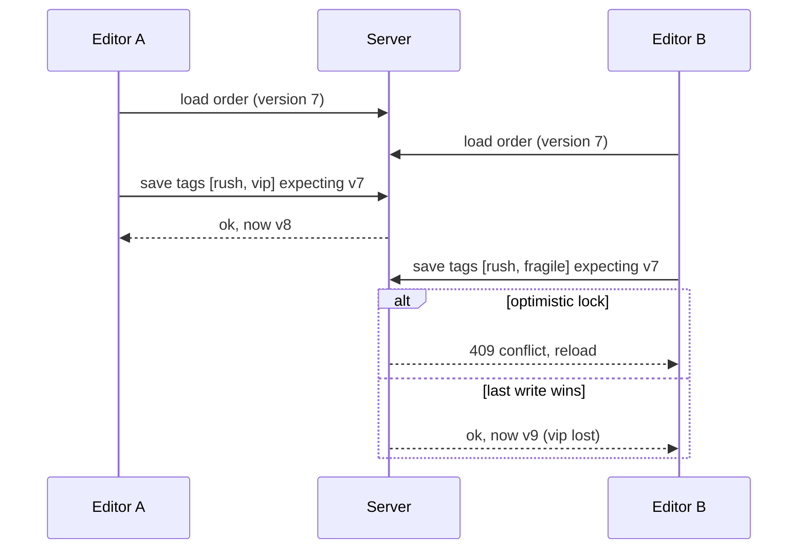

# How each concurrency rule behaves

Two editors load order #4411 with tags `[rush]`. Editor A adds `vip`; editor B adds `fragile`. Both save within seconds.

| Rule | Final tags | What B sees | Cost |
|---|---|---|---|
| Last write wins | `[rush, fragile]` | A success message. A's `vip` is gone and nobody is told. | Nothing to build. Data loss is silent. |
| Optimistic lock | `[rush, vip]` | "This order changed while you were editing. Reload to continue." | One version check on save, one error state in the UI. |
| Merge tag sets | `[rush, vip, fragile]` | A success message. | Removals need tombstones, or a removed tag resurrects on the next merge. |

The bulk import already guards its upsert on `last_updated_at`, so the optimistic-lock rule reuses machinery that exists. The merge rule is the only one that adds a design problem of its own.
